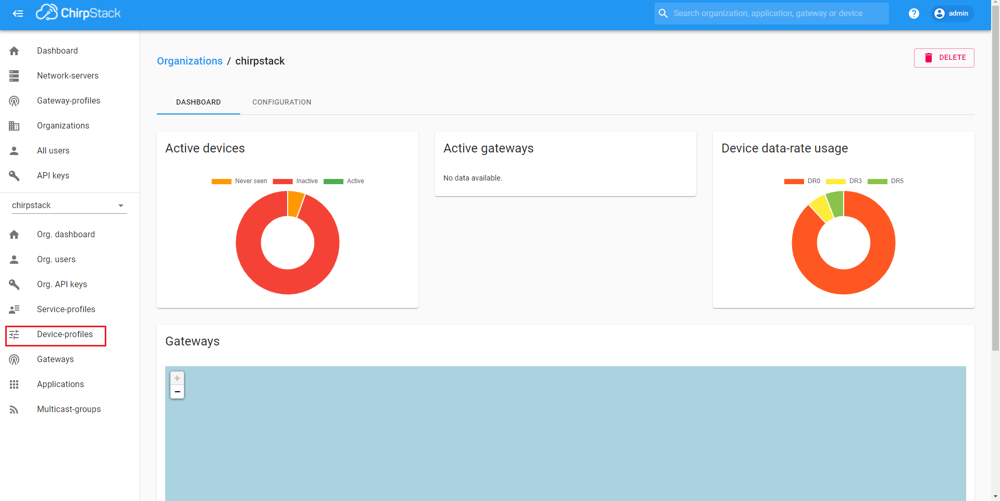
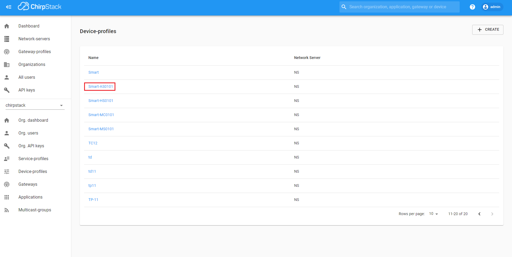
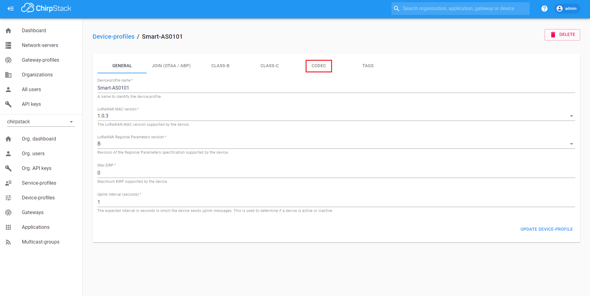
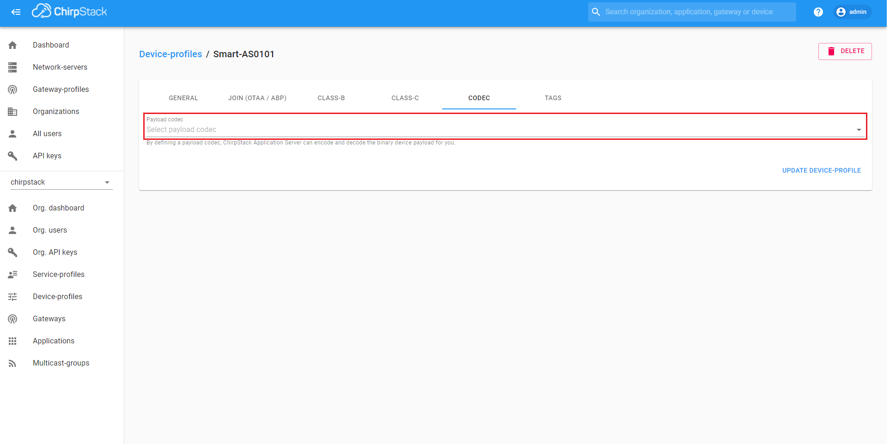
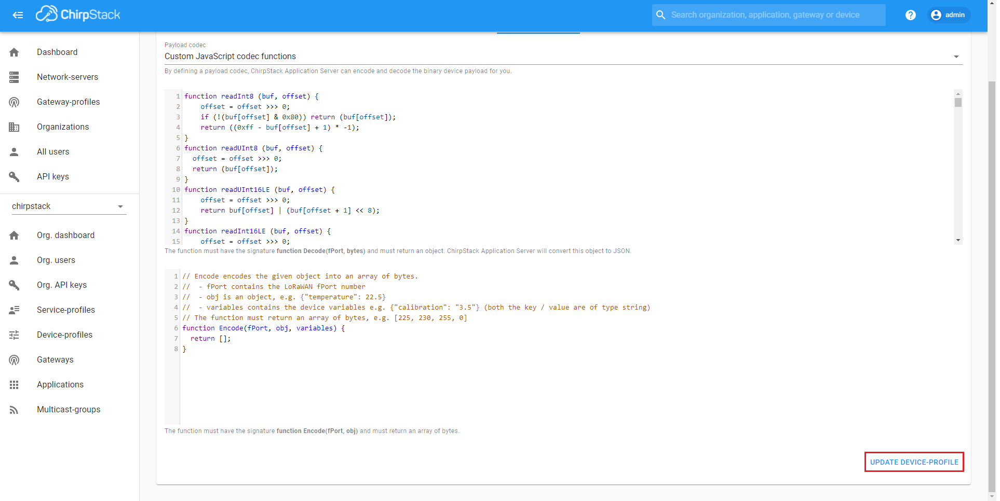
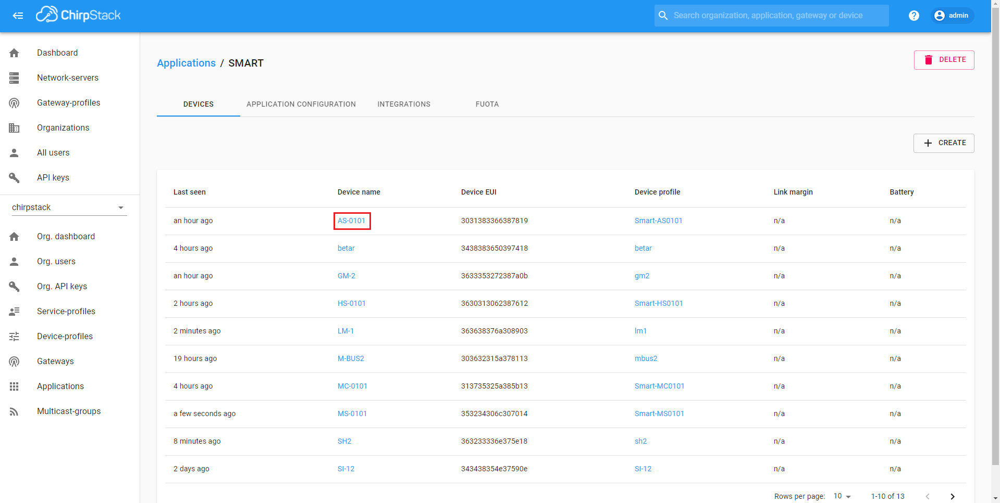
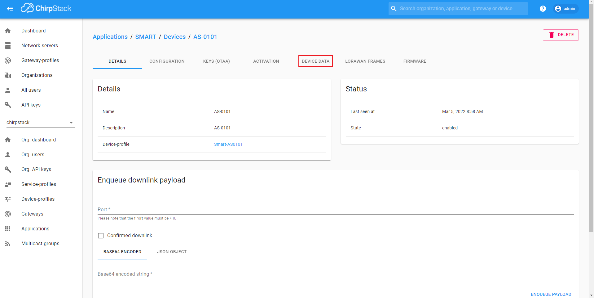
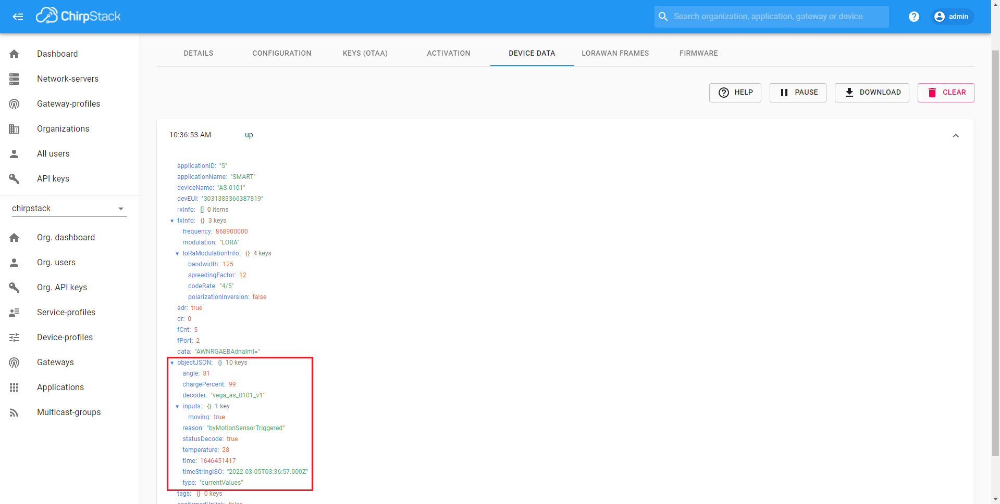

## Adding a device codec to the server

To add a device codec to the server ChirpStack follow the steps:

1. Go to the "devices" folder

2. Go to the folder with the target device name

3. Go to the "scripts" folder and open the file with current version of the script

4. Select the file content and copy to clipboard

5. Open the ChirpStack server in a browser and go to the "Device-profiles" menu

6. Click on the target device profile name

7. Go to the "CODEC" tab

8. Select "Custom JavaScript codec functions" in the "Payload codec" field

9. Paste the content of the script file in the Decode function input area 

10. Click on the "UPDATE DEVICE-PROFILE" button

## Viewing the decoded data

To View the decoded data follow the steps:

1. Go to the "Applications" menu

2. Click on the application name, which include the target device 

3. Click on the device name

4. Go to the "DEVICE DATA" tab

Messages received from the device will be displayed in the opened list.

Message content will display, by click on the message. Decoded data will display in `objectJSON` field.

## Supported devices list

- [Vega Smart-AS0101 - acceleration sensor](devices/as0101/as0101.en-EN.md)
- [Betar-Vega SGBM-1.6 - small-sized household gas meter](devices/betar_sgbm/betar_sgbm.en-EN.md)
- [Betar-Vega SHVE/SGVE - electronic water meter](devices/betar_shve/betar_shve.en-EN.md)
- [Vega GM-2 - modem for Elster gas meters](devices/gm2/gm2.en-EN.md)
- [Vega Smart-HS0101 - sensor of humidity/temperature/door and window/acceleration](devices/hs0101/hs0101.en-EN.md)
- [Vega LM-1 - Tracking device](devices/lm1/lm1.en-EN.md)
- [Vega M-BUS-1 - M-BUS converter](devices/mc0101/mc0101.en-EN.md)
- [Vega M-BUS-2 - M-BUS converter](devices/mbus2/mbus2.en-EN.md)
- [Vega Smart-MC0101 - door and window sensor](devices/mc0101/mc0101.en-EN.md)
- [Vega Smart-MS0101 - motion sensor](devices/ms0101/ms0101.en-EN.md)
- [Vega SH-2 - universal modem](devices/sh2/sh2.en-EN.md)
- [Vega SI-11 - pulse counter](devices/si11/si11.en-EN.md)
- [Vega SI-12 - pulse counter with two outputs](devices/si12/si12.en-EN.md)
- [Vega SI-12 RELAY - pulse counter with built-in relay](devices/si12r/si12r.en-EN.md)
- [Vega SI-22 - pulse counter with external antenna](devices/si22/si22.en-EN.md)
- [Vega Smart-SS0102 - smoke sensor](devices/ss0102/ss0102.en-EN.md)
- [Vega TD-11 - temperature sensor](devices/td11/td11.en-EN.md)
- [Vega TL-11 - Temperature logger](devices/tl11/tl11.en-EN.md)
- [Vega TP-11 - 4-20 mA converter](devices/tp11/tp11.en-EN.md)
- [Vega TS-12 - network tester](devices/ts12/ts12.en-EN.md)
- [Vega Smart-UM0101 - universal office sensor 5 in 1](devices/um0101/um0101.en-EN.md)
- [Vega Smart-WB0101 - LoRaWAN button](devices/wb0101/wb0101.en-EN.md)
- [Electricity meter CE2726A/CE2727A](devices/SPBZIP/SPBZIP.en-EN.md)