## Добавление кодека устройства на сервер

Для того, чтобы добавить кодек устройства на сервер ChirpStack сделайте следующие действия:

1. Перейдите в папку devices

2. Затем перейдите в папку с названием нужного устройства

3. Далее перейдите в папку scripts и откройте файл с актуальной версией скрипта

4. Выделите содержимое файла и скопируйте в буфер обмена

5. Откройте в браузере сервер ChirpStack и перейдите в меню "Device-profiles"
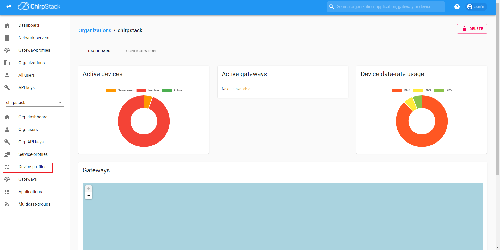

6. Нажмите на имя профиля устройства

7. Перейдите во вкладку "CODEC"
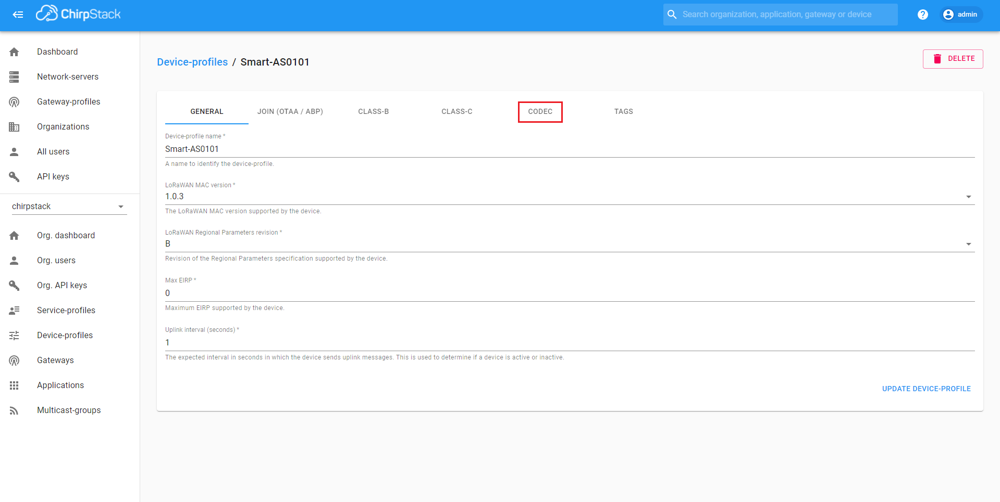

8. В поле "Payload codec" выберите значение "Custom JavaScript codec functions"
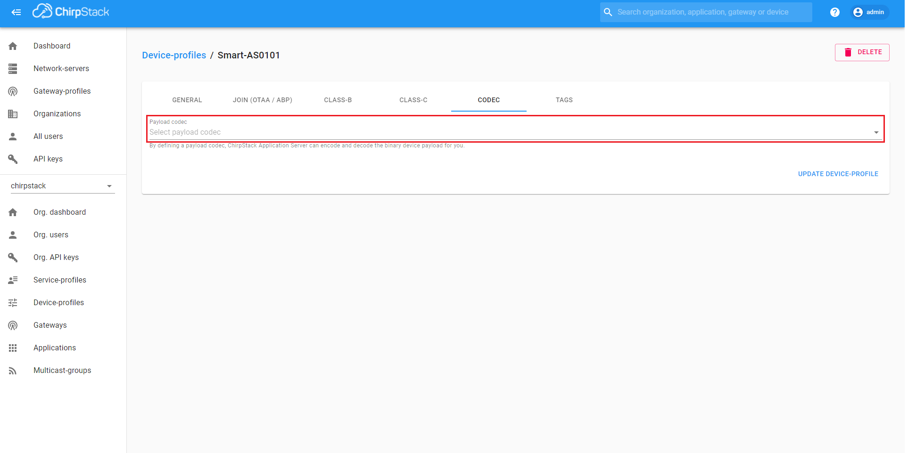

9. В область ввода, соответствующую функции расшифровки, вставьте содержимое файла со скриптом
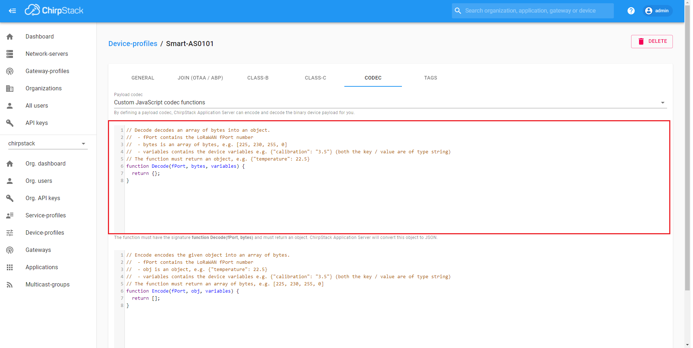

10. Нажмите кнопку "UPDATE DEVICE-PROFILE"
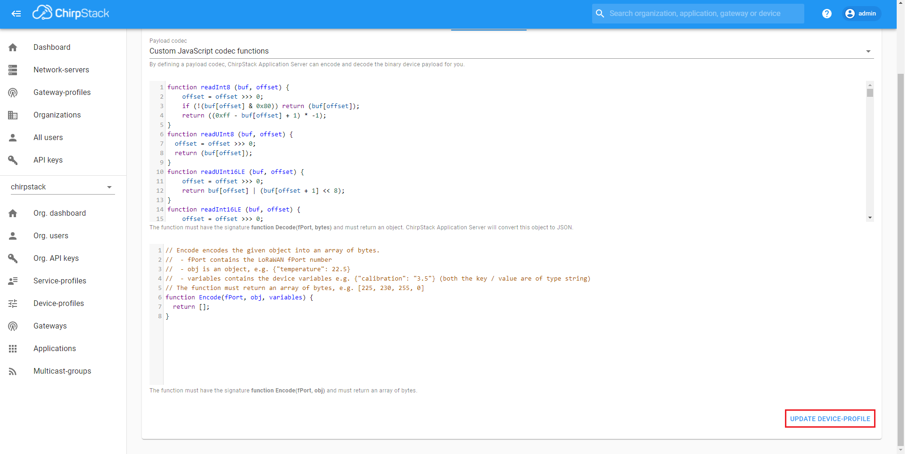

## Чтение расшифрованных данных

Для того, чтобы прочитать расшифрованные данные сделайте следующие действия:

1. Перейдите в меню "Applications"
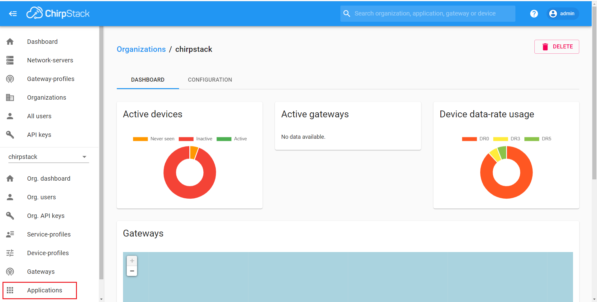

2. Нажмите на имя приложения, в котором содержится нужное устройство
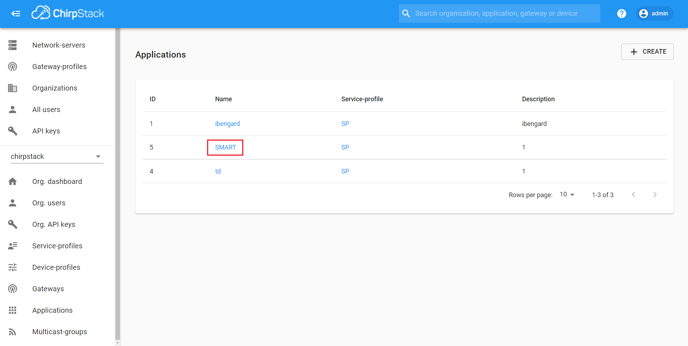

3. Нажмите на имя устройства
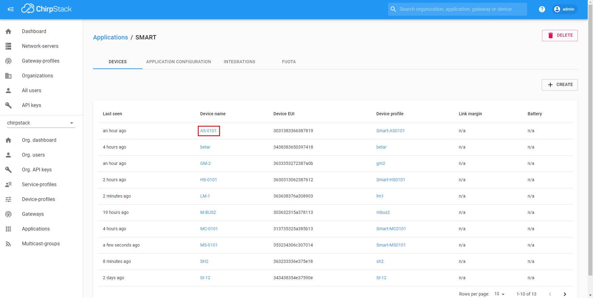

4. Перейдите во вкладку "DEVICE DATA"
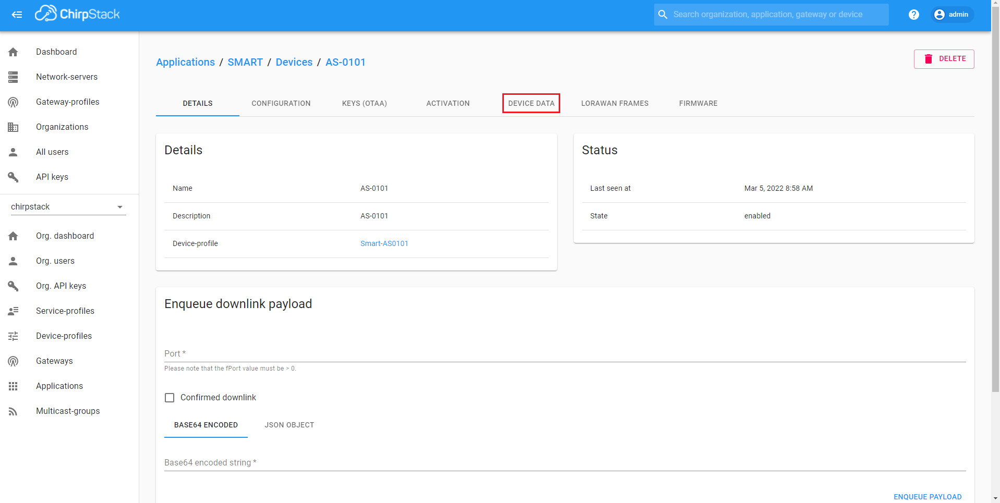

В открывшемся списке будут отображаться сообщения, получаемые от устройства

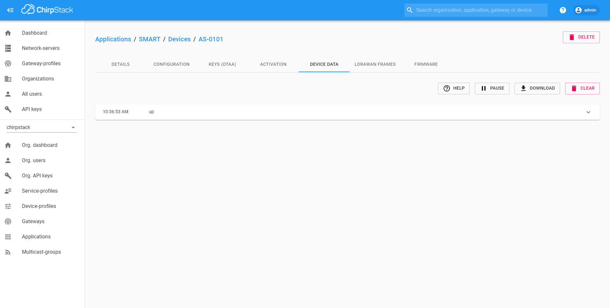

При нажатии на сообщения раскроется содержимое сообщения, расшифрованные данные будут отображаться в поле `objectJSON`

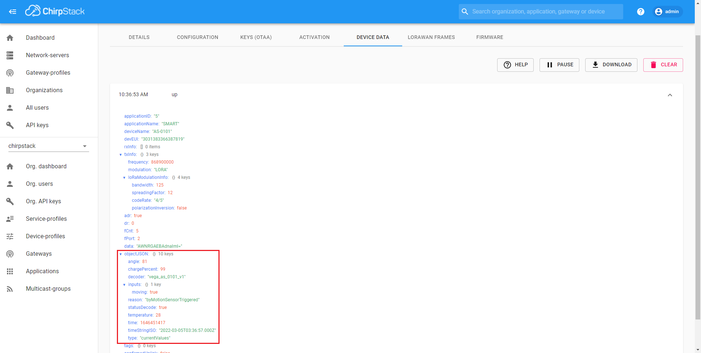

## Перечень поддерживаемых устройств

- [Вега Smart-AS0101 - датчик ускорения](devices/as0101/as0101.ru-RU.md)
- [Бетар-Вега СГБМ-1.6 - счетчик газа бытовой малогабаритный](devices/betar_sgbm/betar_sgbm.ru-RU.md)
- [Бетар-Вега СХВЭ/СГВЭ - счетчик воды крыльчатый электронный](devices/betar_shve/betar_shve.ru-RU.md)
- [Вега GM-2 - модем для счетчиков газа Elster](devices/gm2/gm2.ru-RU.md)
- [Вега Smart-HS0101 - датчик влажности/температуры/открытия/ускорения](devices/hs0101/hs0101.ru-RU.md)
- [Вега LM-1 - Поисковое устройство](devices/lm1/lm1.ru-RU.md)
- [Вега M-BUS-1 - конвертер M-BUS](devices/mc0101/mc0101.ru-RU.md)
- [Вега M-BUS-2 - конвертер M-BUS](devices/mbus2/mbus2.ru-RU.md)
- [Вега Smart-MC0101 - магнитоконтактный датчик](devices/mc0101/mc0101.ru-RU.md)
- [Вега Smart-MS0101 - датчик движения](devices/ms0101/ms0101.ru-RU.md)
- [Вега SH-2 - Универсальный модем](devices/sh2/sh2.ru-RU.md)
- [Вега СИ-11 - счётчик импульсов](devices/si11/si11.ru-RU.md)
- [Вега СИ-12 - счётчик импульсов с двумя выходами](devices/si12/si12.ru-RU.md)
- [Вега СИ-12 Реле - счетчик импульсов со встроенным реле](devices/si12r/si12r.ru-RU.md)
- [Вега СИ-22 - счётчик импульсов с внешней антенной](devices/si22/si22.ru-RU.md)
- [Вега Smart-SS0102 - датчик дыма](devices/ss0102/ss0102.ru-RU.md)
- [Вега ТД-11 - температурный датчик](devices/td11/td11.ru-RU.md)
- [Вега ТЛ-11 - Температурный логгер](devices/tl11/tl11.ru-RU.md)
- [Вега ТП-11 - конвертер 4-20мА](devices/tp11/tp11.ru-RU.md)
- [Вега ТС-12 - тестер сети](devices/ts12/ts12.ru-RU.md)
- [Вега Smart-UM0101 - универсальный офисный датчик 5 в 1](devices/um0101/um0101.ru-RU.md)
- [Вега Smart-WB0101 - кнопка подачи сигнала](devices/wb0101/wb0101.ru-RU.md)
- [Счетчик электрической энергии ООО «Спб ЗИП»](devices/SPBZIP/SPBZIP.ru-RU.md)