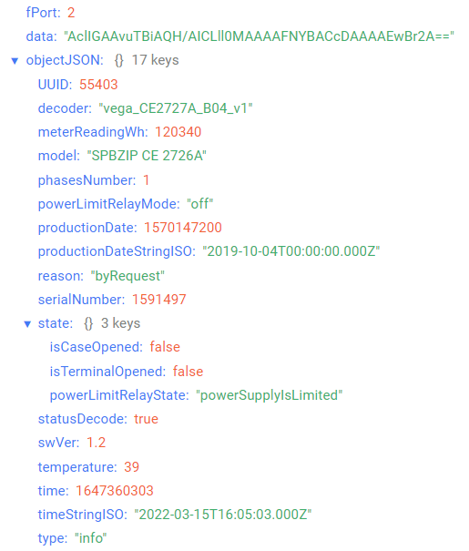
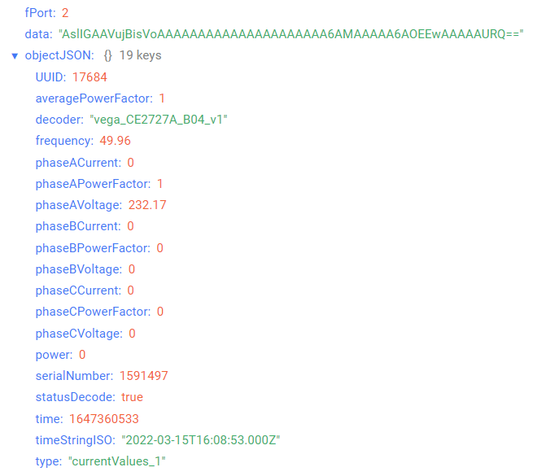
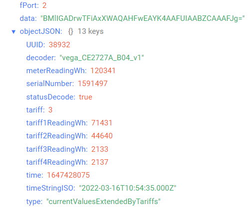

# Electricity meter CE2726A/CE2727A

## Device description

An electronic electricity meter CE2726A and CE2727A are designed for multi-tariff (up to 4 tariffs) energy metering in AC networks with a rated frequency of 50 Hz.
The radio module is installed inside, which accumulates and transmits information about the readings to the LoRaWAN® network.
Also, the meter is equipped with a power limiting relay, which can trigger both internal events and a command from the server.
The meter acts as a LoRaWAN® device of class C.

## Description of data fields

### Meter information packet

Meter information packet sent on port 2 and contains the following fields:
- `decoder` - name and version of the decoder, data type `String`;
- `meterReadingWh` - current meter reading (Wh), data type `Number`;
- `model` - meter model name, data type `String`;
- `phasesNumber` - phases number, data type `Number`;
- `powerLimitRelayMode` - power limit relay mode (**on/off**), data type `String`;
- `productionDate` - meter production date in Unix-time format (sec), data type `Number`;
- `productionDateStringISO` - meter production date in ISO format, data type `String`;
- `reason` - sending reason (**byTime** - by time, **byTerminalOpening** - by terminal opening, **byCaseOpening** - by case opening, **byPowerLimitRelayOperation** - by power limit relay operation, **byOvervoltage** - by overvoltage, **byPowerLimitExceeding** - by power limit exceeding, **byElectricityPowerOff** - by electricity power off, **byRequest** - by request, **byElectricityPowerOn** - by electricity power on, **byVoltageDip** - by voltage dip, **byFrequencyDeviation** - by frequency deviation), data type `String`;
- `serialNumber` - meter serial number, data type `Number`;
- `state` - meter current state, data type `Object`, contains the following fields:
    - `isCaseOpened` - case state (**true** - if case is opened and **false** - if case is not opened), data type `Boolean`;
    - `isTerminalOpened` - terminal cover state (**true** - if terminal cover is opened and **false** - if terminal cover is not opened), data type `Boolean`;
    - `powerLimitRelayState` - power limit relay state (**powerSupplyIsLimited** - power supply is limited, **powerSupplyIsUnlimited** - power supply is unlimited), data type `String`;
- `statusDecode` - data decode status (**true** if decode is successful and **false** if decode is not successful), data type `Boolean`;
- `swVer` - LoRa module software version, data type `Number`;
- `temperature` - temperature (°С), data type `Number`;
- `time` - reading time for values in this packet in Unix-time format (sec), data type `Number`;
- `timeStringISO` - reading time for values in this packet in ISO format, data type `String`;
- `type` - packet type, data type `String`.
- `UUID` - UUID, data type `Number`.

An example of decoded message:

### Current state packet (part 1)

Current state packet (part 1) sent on port 2 and contains the following fields:
- `averagePowerFactor` - average power factor, data type `Number`;
- `decoder` - name and version of the decoder, data type `String`;
- `frequency` - frequency (Hz), data type `Number`;
- `phaseACurrent` - phase A current (A), data type `Number`;
- `phaseAPowerFactor` - phase A power factor, data type `Number`;
- `phaseAVoltage` - phase A voltage (V), data type `Number`;
- `phaseBCurrent` - phase B current (A), data type `Number`;
- `phaseBPowerFactor` - phase B power factor, data type `Number`;
- `phaseBVoltage` - phase B voltage (V), data type `Number`;
- `phaseCCurrent` - phase C current (A), data type `Number`;
- `phaseCPowerFactor` - phase C power factor, data type `Number`;
- `phaseCVoltage` - phase C voltage (V), data type `Number`;
- `power` - power (W), data type `Number`;
- `serialNumber` - meter serial number, data type `Number`;
- `statusDecode` - data decode status (**true** if decode is successful and **false** if decode is not successful), data type `Boolean`;
- `time` - reading time for values in this packet in Unix-time format (sec), data type `Number`;
- `timeStringISO` - reading time for values in this packet in ISO format, data type `String`;
- `type` - packet type, data type `String`.
- `UUID` - UUID, data type `Number`.

An example of decoded message:

### Meter readings extended by tariffs packet

Meter readings extended by tariffs packet sent on port 2 and contains the following fields:
- `decoder` - name and version of the decoder, data type `String`;
- `meterReadingWh` - current meter reading, total for all tariffs (Wh), data type `Number`;
- `serialNumber` - meter serial number, data type `Number`;
- `statusDecode` - data decode status (**true** if decode is successful and **false** if decode is not successful), data type `Boolean`;
- `tariff` - current tariff (1-4), data type `Number`;
- `tariff1ReadingWh` - current meter readings at tariff 1 (Wh), data type `Number`;
- `tariff2ReadingWh` - current meter readings at tariff 2 (Wh), data type `Number`;
- `tariff3ReadingWh` - current meter readings at tariff 3 (Wh), data type `Number`;
- `tariff4ReadingWh` - current meter readings at tariff 4 (Wh), data type `Number`;
- `time` - reading time for values in this packet in Unix-time format (sec), data type `Number`;
- `timeStringISO` - reading time for values in this packet in ISO format, data type `String`;
- `type` - packet type, data type `String`.
- `UUID` - UUID, data type `Number`.

An example of decoded message:

### Time correction request packet

Time correction request packet sent on port 4 and contains the following fields:
- `decoder` - name and version of the decoder, data type `String`;
- `statusDecode` - data decode status (**true** if decode is successful and **false** if decode is not successful), data type `Boolean`;
- `time` - reading time for values in this packet in Unix-time format (sec), data type `Number`;
- `timeStringISO` - reading time for values in this packet in ISO format, data type `String`;
- `type` - packet type, data type `String`.

### Setting packet

Setting packet sent on port 3 and contains the following fields:
- `decoder` - name and version of the decoder, data type `String`;
- `settings` - current device settings values, data type `Object` (object keys are setting identifiers);
- `statusDecode` - data decode status (**true** if decode is successful and **false** if decode is not successful), data type `Boolean`;
- `type` - packet type, data type `String`.

Setting object contains the following fields:
- `id` - unique identifier for the setting, data type `Number`;
- `length` - setting value length (байт), data type `Number`;
- `name` - setting name, data type `String`;
- `rawValue` - raw setting value, data type `String`;
- `value` - setting value, data type depends on parameter.