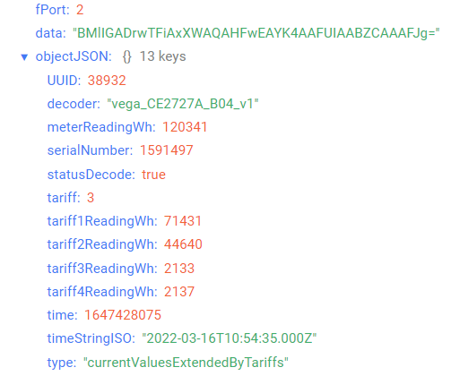

# Счетчик электрической энергии ООО «Спб ЗИП»

## Описание устройства

Счетчики ЦЭ2726А и ЦЭ2727А предназначены для многотарифного (до 4 тарифов) учета активной энергии в сетях переменного тока номинальной частотой 50 Гц. Счетчики соответствуют требованиям ГОСТ 31818.11-2012, ГОСТ 31819.21-2012. Подключаются к электрической сети непосредственно. Степень защиты корпуса счетчика от проникновения воды и пыли внутрь счетчика соответствует IP51.
Внутри установлен радиомодуль, накапливающий и передающий информацию о показаниях в сеть LoRaWAN.
Также счетчик оснащен реле ограничения мощности, которое может срабатывать как по внутренним событиям, так и по команде с сервера.
Счетчик работает как устройство LoRaWAN® класса С.

## Описание полей данных

### Пакет с информацией о счетчике

Пакет с информацией о счетчике приходит на порт 2 и содержит следующие поля:
- `decoder` - имя и версия дешифратора, тип данных `String`;
- `meterReadingWh` - текущие показания счетчика (Вт*ч), тип данных `Number`;
- `model` - модель счетчика, тип данных `String`;
- `phasesNumber` - количество фаз, тип данных `Number`;
- `powerLimitRelayMode` - состояние реле ограничения мощности (**on** включено и **off** отключено), тип данных `String`;
- `productionDate` - дата выпуска счетчика в формате Unix-time (с), тип данных `Number`;
- `productionDateStringISO` - дата выпуска счетчика в формате ISO, тип данных `String`;
- `reason` - причина отправки пакета (**byTime** - по времени, **byTerminalOpening** - вскрытие клеммной крышки, **byCaseOpening** - вскрытие корпуса, **byPowerLimitRelayOperation** - срабатывание реле ограничения, **byOvervoltage** - превышение напряжения по одной или нескольким фазам, **byPowerLimitExceeding** - превышение лимита мощности, **byElectricityPowerOff** - отключение электропитания электросчётчика, **byRequest** - по запросу, **byElectricityPowerOn** - включение электропитания электросчетчика, **byVoltageDip** - провал напряжения по одной или нескольким фазам, **byFrequencyDeviation** - отклонение частоты), тип данных `String`;
- `serialNumber` - серийный номер электросчётчика, тип данных `Number`;
- `state` - текущее состояние, тип данных `Object`, содержит следующие поля:
    - `isCaseOpened` - признак вскрытия корпуса (**true** - если корпус открыт и **false** - если корпус закрыт), тип данных `Boolean`;
    - `isTerminalOpened` - признак вскрытия клеммной крышки (**true** - если клеммная крышка открыта и **false** - если клеммная крышка закрыта), тип данных `Boolean`;
    - `powerLimitRelayState` - состояние реле ограничения нагрузки (**powerSupplyIsLimited** - подача ограничена, **powerSupplyIsUnlimited** - энергия подается), тип данных `String`;
- `statusDecode` - состояние расшифровки данных (**true** если расшифровка успешна и **false** если неуспешна), тип данных `Boolean`;
- `swVer` - версия ПО LoRa-модуля, тип данных `Number`;
- `temperature` - температура (°С), тип данных `Number`;
- `time` - время снятия показаний, передаваемых в пакете в формате Unix-time (с), тип данных `Number`;
- `timeStringISO` - время снятия показаний, передаваемых в пакете в формате ISO, тип данных `String`;
- `type` - тип пакета, тип данных `String`;
- `UUID` - UUID запроса, тип данных `Number`.

Пример расшифрованного сообщения:

### Пакет мгновенных значений (блок 1)

Пакет мгновенных значений (блок 1) приходит на порт 2 и содержит следующие поля:
- `averagePowerFactor` - средний коэффициент мощности, тип данных `Number`;
- `decoder` - имя и версия дешифратора, тип данных `String`;
- `frequency` - частота (Гц), тип данных `Number`;
- `phaseACurrent` - ток фазы A (А), тип данных `Number`;
- `phaseAPowerFactor` - коэффициент мощности фазы A, тип данных `Number`;
- `phaseAVoltage` - напряжение фазы A (В), тип данных `Number`;
- `phaseBCurrent` - ток фазы B (А), тип данных `Number`;
- `phaseBPowerFactor` - коэффициент мощности фазы B, тип данных `Number`;
- `phaseBVoltage` - напряжение фазы B (В), тип данных `Number`;
- `phaseCCurrent` - ток фазы C (А), тип данных `Number`;
- `phaseCPowerFactor` - коэффициент мощности фазы C, тип данных `Number`;
- `phaseCVoltage` - напряжение фазы C (В), тип данных `Number`;
- `power` - мощность (Вт), тип данных `Number`;
- `serialNumber` - серийный номер электросчётчика, тип данных `Number`;
- `statusDecode` - состояние расшифровки данных (**true** если расшифровка успешна и **false** если неуспешна), тип данных `Boolean`;
- `time` - время снятия показаний, передаваемых в пакете в формате Unix-time (с), тип данных `Number`;
- `timeStringISO` - время снятия показаний, передаваемых в пакете в формате ISO, тип данных `String`;
- `type` - тип пакета, тип данных `String`;
- `UUID` - UUID запроса, тип данных `Number`.

Пример расшифрованного сообщения:

### Пакет с показаниями счетчика расширенными по тарифам

Пакет с показаниями счетчика расширенными по тарифам приходит на порт 2 и содержит следующие поля:
- `decoder` - имя и версия дешифратора, тип данных `String`;
- `meterReadingWh` - текущие показания счетчика, сумма всех тарифов (Вт*ч), тип данных `Number`;
- `serialNumber` - серийный номер электросчётчика, тип данных `Number`;
- `statusDecode` - состояние расшифровки данных (**true** если расшифровка успешна и **false** если неуспешна), тип данных `Boolean`;
- `tariff` - текущий тариф (1-4), тип данных `Number`;
- `tariff1ReadingWh` - показания по тарифу 1 (Вт*ч), тип данных `Number`;
- `tariff2ReadingWh` - показания по тарифу 2 (Вт*ч), тип данных `Number`;
- `tariff3ReadingWh` - показания по тарифу 3 (Вт*ч), тип данных `Number`;
- `tariff4ReadingWh` - показания по тарифу 4 (Вт*ч), тип данных `Number`;
- `time` - время снятия показаний, передаваемых в пакете в формате Unix-time (с), тип данных `Number`;
- `timeStringISO` - время снятия показаний, передаваемых в пакете в формате ISO, тип данных `String`;
- `type` - тип пакета, тип данных `String`;
- `UUID` - UUID запроса, тип данных `Number`.

Пример расшифрованного сообщения:

### Пакет с запросом корректировки времени

Пакет с запросом корректировки времени приходит на порт 4 и содержит следующие поля:
- `decoder` - имя и версия дешифратора, тип данных `String`;
- `statusDecode` - состояние расшифровки данных (**true** если расшифровка успешна и **false** если неуспешна), тип данных `Boolean`;
- `time` - время снятия показаний, передаваемых в пакете в формате Unix-time (с), тип данных `Number`;
- `timeStringISO` - время снятия показаний, передаваемых в пакете в формате ISO, тип данных `String`;
- `type` - тип пакета, тип данных `String`.

### Пакет с настройками

Пакет с настройками приходит на порт 3 и содержит следующие поля:
- `decoder` - имя и версия дешифратора, тип данных `String`;
- `settings` - текущие значения настроек устройства, тип данных `Object` (ключами объекта являются номера параметров);
- `statusDecode` - состояние расшифровки данных (**true** если расшифровка успешна и **false** если неуспешна), тип данных `Boolean`;
- `type` - тип пакета, тип данных `String`.

Объект параметра, содержит следующие поля:
- `id` - номера параметра, тип данных `Number`;
- `length` - длина значения параметра (байт), тип данных `Number`;
- `name` - имя параметра, тип данных `String`;
- `rawValue` - необработанное значение параметра, тип данных `String`;
- `value` - значение параметра, тип данных зависит от параметра.