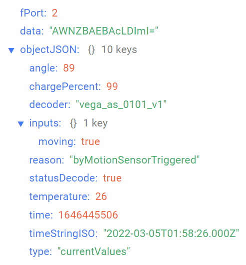
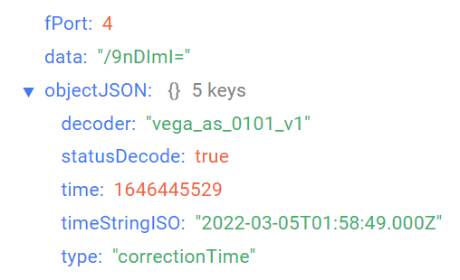

# Вега Smart-AS0101 - датчик ускорения

## Описание устройства

Датчик ускорения Вега Smart-AS0101 предназначен для охраны помещений,
зданий и сооружений, а также для использования в системах «Умный дом», построенных
на технологии LoRaWAN®.

Датчик имеет встроенный акселерометр, который реагирует на перемещение или
сотрясение и может быть настроен на один из трёх уровней чувствительности. При
срабатывании датчик отправляет в сеть LoRaWAN тревожное сообщение.

## Описание полей данных

### Пакет с текущим состоянием

Пакет с текущим состоянием приходит на порт 2 и содержит следующие поля:
- `angle` - угол отклонения датчика от вертикали (0-90°), тип данных `Number`;
- `chargePercent` - заряд батареи (%), тип данных `Number`;
- `decoder` - имя и версия дешифратора, тип данных `String`;
- `inputs` - состояние входов, тип данных `Object`, содержит следующие поля:
    - `moving` - состояние акселерометра (**true** если зафиксировано движение и **false** если движение не зафиксированно), тип данных `Boolean`;
- `reason` - причина отправки пакета (**byTime** - по времени, **byMotionSensorTriggered** - сработал датчик движения), тип данных `String`;
- `statusDecode` - состояние расшифровки данных (**true** если расшифровка успешна и **false** если неуспешна), тип данных `Boolean`;
- `temperature` - температура (°С), тип данных `Number`;
- `time` - время снятия показаний, передаваемых в пакете в формате Unix-time (с), тип данных `Number`;
- `timeStringISO` - время снятия показаний, передаваемых в пакете в формате ISO, тип данных `String`;
- `type` - тип пакета, тип данных `String`.

Пример расшифрованного сообщения:

### Пакет с запросом корректировки времени

Пакет с запросом корректировки времени приходит на порт 4 и содержит следующие поля:
- `decoder` - имя и версия дешифратора, тип данных `String`;
- `statusDecode` - состояние расшифровки данных (**true** если расшифровка успешна и **false** если неуспешна), тип данных `Boolean`;
- `time` - время снятия показаний, передаваемых в пакете в формате Unix-time (с), тип данных `Number`;
- `timeStringISO` - время снятия показаний, передаваемых в пакете в формате ISO, тип данных `String`;
- `type` - тип пакета, тип данных `String`.

Пример расшифрованного сообщения:

### Пакет с настройками

Пакет с настройками приходит на порт 3 и содержит следующие поля:
- `decoder` - имя и версия дешифратора, тип данных `String`;
- `settings` - текущие значения настроек устройства, тип данных `Object` (ключами объекта являются номера параметров);
- `statusDecode` - состояние расшифровки данных (**true** если расшифровка успешна и **false** если неуспешна), тип данных `Boolean`;
- `type` - тип пакета, тип данных `String`.

Объект параметра, содержит следующие поля:
- `id` - номера параметра, тип данных `Number`;
- `length` - длина значения параметра (байт), тип данных `Number`;
- `name` - имя параметра, тип данных `String`;
- `rawValue` - необработанное значение параметра, тип данных `String`;
- `value` - значение параметра, тип данных зависит от параметра.

Пример расшифрованного сообщения:

