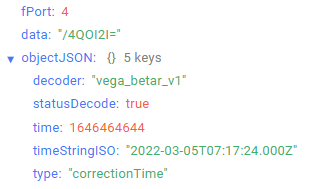
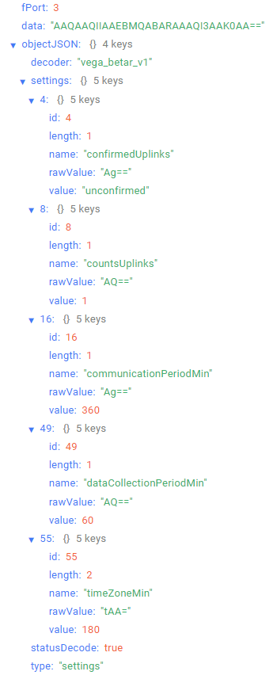

# Betar-Vega SHVE/SGVE - electronic water meter

## Device description

An electronic water meter Betar-Vega SHVE/SGVE is used to account for the flow of cold water at temperatures from 5 to 40 °С for cold water meters (SHVE) and of hot water at temperatures from 5 to 90 °С for hot water meters (SGVE) at a pressure of not more than 1.0 MPa (10 kgf/cm) with the accumulation and transfer of these readings to the LoRaWAN® network by means of radio communications at frequencies in the range of 860-1000 MHz.

## Description of data fields

### Current readings packet

Current readings packet sent on port 2 and contains the following fields:
- `chargePercent` - battery charge (%), data type `Number`;
- `consumption` - current readings (cbm), data type `Number`;
- `decoder` - name and version of the decoder, data type `String`;
- `isDigitalIndicatorBlocked` - LED indicator lock flag (**true** if LED indicator is locked and **false** if LED indicator is not locked), data type `Boolean`;
- `isLeakDetected` - Leak flag (continuous consumption < 0.3 cbm per 30 minutes)
 (**true** if leak if detected and **false** if leak if not detected), data type `Boolean`;
- `isMagneticFieldEffectDetected` - external magnetic field effect (**true** if external magnetic field effect is detected and **false** if external magnetic field effect is not detected), data type `Boolean`;
- `isPipeBreakDetected` - breakthrough flag (continuous consumption > 0.3 cbm per 30
minutes)  (**true** if breakthrough is detected and **false** if breakthrough is not detected), data type `Boolean`;
- `statusDecode` - data decode status (**true** if decode is successful and **false** if decode is not successful), data type `Boolean`;
- `temperature` - temperature (°С), data type `Number`;
- `time` - reading time for values in this packet in Unix-time format (sec), data type `Number`;
- `timeStringISO` - reading time for values in this packet in ISO format, data type `String`;
- `type` - packet type, data type `String`.

An example of decoded message:

### Time correction request packet

Time correction request packet sent on port 4 and contains the following fields:
- `decoder` - name and version of the decoder, data type `String`;
- `statusDecode` - data decode status (**true** if decode is successful and **false** if decode is not successful), data type `Boolean`;
- `time` - reading time for values in this packet in Unix-time format (sec), data type `Number`;
- `timeStringISO` - reading time for values in this packet in ISO format, data type `String`;
- `type` - packet type, data type `String`.

An example of decoded message:

### Setting packet

Setting packet sent on port 3 and contains the following fields:
- `decoder` - name and version of the decoder, data type `String`;
- `settings` - current device settings values, data type `Object` (object keys are setting identifiers);
- `statusDecode` - data decode status (**true** if decode is successful and **false** if decode is not successful), data type `Boolean`;
- `type` - packet type, data type `String`.

Setting object contains the following fields:
- `id` - unique identifier for the setting, data type `Number`;
- `length` - setting value length (байт), data type `Number`;
- `name` - setting name, data type `String`;
- `rawValue` - raw setting value, data type `String`;
- `value` - setting value, data type depends on parameter.

An example of decoded message:

