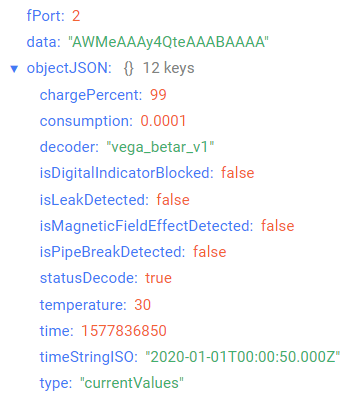
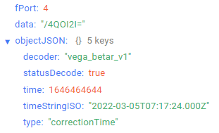
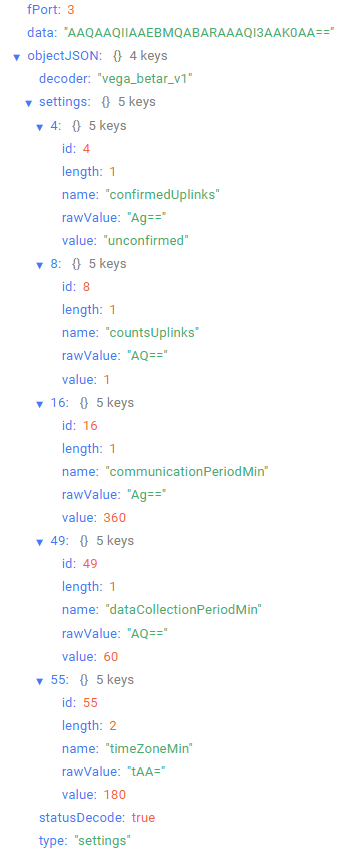

# Бетар-Вега СХВЭ/СГВЭ - счетчик воды крыльчатый электронный

## Описание устройства

Счетчик Бетар-Вега СХВЭ/СГВЭ предназначен для измерения объема питьевой воды протекающей по трубопроводу при температуре от плюс 5 до плюс 40 °С
для счетчиков холодной воды (СХВЭ) и от плюс 5 до плюс 90 °С для счетчиков горячей воды (СГВЭ)
при давлении не более 1,0 МПа (10кгс/см) с последующим накоплением и передачей этой
информации в сеть LoRaWAN® посредством радиосвязи на частотах диапазона 860-1000 МГц.

## Описание полей данных

### Пакет с текущими показаниями

Пакет с текущими показаниями приходит на порт 2 и содержит следующие поля:
- `chargePercent` - заряд батареи (%), тип данных `Number`;
- `consumption` - текущие показания (куб.м), тип данных `Number`;
- `decoder` - имя и версия дешифратора, тип данных `String`;
- `isDigitalIndicatorBlocked` - признак блокировки цифрового индикатора (**true** если индикатор заблокирован и **false** если индикатор разблокирован), тип данных `Boolean`;
- `isLeakDetected` - признак утечки (непрерывный расход воды в течение
получаса объемом менее 0,3 куб.м) (**true** если зафиксирована утечка и **false** если утечка не зафиксирована), тип данных `Boolean`;
- `isMagneticFieldEffectDetected` - наличие воздействия внешнего магнитного поля (**true** если зафиксировано и **false** если не зафиксировано), тип данных `Boolean`;
- `isPipeBreakDetected` - признак прорыва а (непрерывный расход воды в течение
получаса объемом более 0,3 куб.м)  (**true** если зафиксирован прорыв и **false** если прорыв не зафиксирован), тип данных `Boolean`;
- `statusDecode` - состояние расшифровки данных (**true** если расшифровка успешна и **false** если неуспешна), тип данных `Boolean`;
- `temperature` - температура (°С), тип данных `Number`;
- `time` - время снятия показаний, передаваемых в пакете в формате Unix-time (с), тип данных `Number`;
- `timeStringISO` - время снятия показаний, передаваемых в пакете в формате ISO, тип данных `String`;
- `type` - тип пакета, тип данных `String`.

Пример расшифрованного сообщения:

### Пакет с запросом корректировки времени

Пакет с запросом корректировки времени приходит на порт 4 и содержит следующие поля:
- `decoder` - имя и версия дешифратора, тип данных `String`;
- `statusDecode` - состояние расшифровки данных (**true** если расшифровка успешна и **false** если неуспешна), тип данных `Boolean`;
- `time` - время снятия показаний, передаваемых в пакете в формате Unix-time (с), тип данных `Number`;
- `timeStringISO` - время снятия показаний, передаваемых в пакете в формате ISO, тип данных `String`;
- `type` - тип пакета, тип данных `String`.

Пример расшифрованного сообщения:

### Пакет с настройками

Пакет с настройками приходит на порт 3 и содержит следующие поля:
- `decoder` - имя и версия дешифратора, тип данных `String`;
- `settings` - текущие значения настроек устройства, тип данных `Object` (ключами объекта являются номера параметров);
- `statusDecode` - состояние расшифровки данных (**true** если расшифровка успешна и **false** если неуспешна), тип данных `Boolean`;
- `type` - тип пакета, тип данных `String`.

Объект параметра, содержит следующие поля:
- `id` - номера параметра, тип данных `Number`;
- `length` - длина значения параметра (байт), тип данных `Number`;
- `name` - имя параметра, тип данных `String`;
- `rawValue` - необработанное значение параметра, тип данных `String`;
- `value` - значение параметра, тип данных зависит от параметра.

Пример расшифрованного сообщения:

