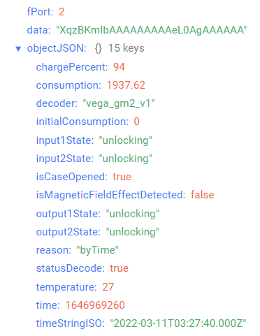
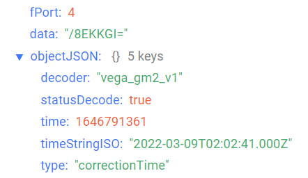
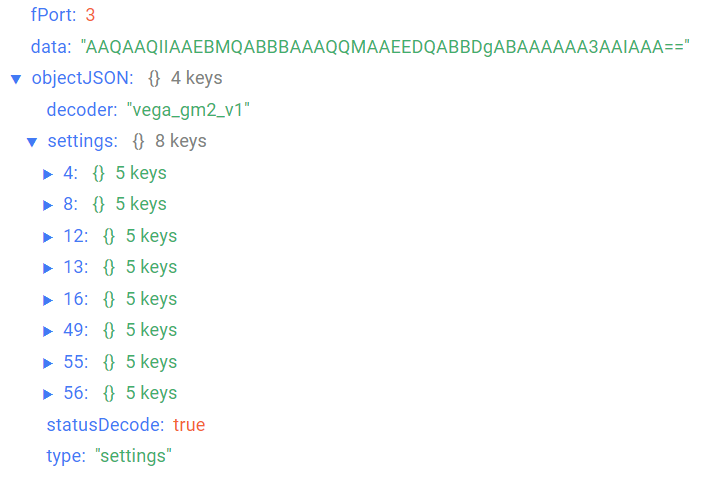

# Vega GM-2 - modem for Elster gas meters

## Device description

LoRaWAN® modem GM-2 is designed to take readings from Elster gas meters, with the subsequent accumulation and transfer of this information to the LoRaWAN® network.

The modem is equipped with Hall sensors, one of which calculates the current meter readings and the other is located in such a way and has a sensitivity level that reacts only to the presence of an external magnetic field (for example, when a strong magnet is placed near the gas meter to disable the counting mechanism).

To protect against unauthorized access, the modem has a tamper. There are also two security inputs and two open-drain outputs for control of an external devices.

## Description of data fields

### Current state packet

Current state packet sent on port 2 and contains the following fields:
- `chargePercent` - battery charge (%), data type `Number`;
- `consumption` - meter readings at moment of packet sending (cbm), data type `Number`;
- `decoder` - name and version of the decoder, data type `String`;
- `initialConsumption` - initial meter readings at moment of modem installing (cbm), data type `Number`;
- `input1State` - input 1 state (**closure** if input is closed and **unlocking** if input is unclosed), data type `String`;
- `input2State` - input 2 state (**closure** if input is closed and **unlocking** if input is unclosed), data type `String`;
- `isCaseOpened` - case opening flag (**true** if case is opened and **false** if case is closed), data type `Boolean`;
- `isMagneticFieldEffectDetected` - external magnetic field effect (**true** if external magnetic field effect is detected and **false** if external magnetic field effect is not detected), data type `Boolean`;
- `output1State` - output 1 state (**closure** if output is closed and **unlocking** if output is unclosed), data type `String`;
- `output2State` - output 2 state (**closure** if output is closed and **unlocking** if output is unclosed), data type `String`;
- `reason` - sending reason (**byTime** - by the time, **bySecurityInput1Triggered** - by the input 1 alarm, **bySecurityInput2Triggered** - by the input 2 alarm, **byOutput1StateChanged** - by the output 1 state changing, **byOutput2StateChanged** - by the output 2 state changing, **byMagneticFieldEffectDetected** - by the external magnetic field effect, **byCaseOpened** - by case opening), data type `String`;
- `statusDecode` - data decode status (**true** if decode is successful and **false** if decode is not successful), data type `Boolean`;
- `temperature` - temperature (°С), data type `Number`;
- `time` - reading time for values in this packet in Unix-time format (sec), data type `Number`;
- `timeStringISO` - reading time for values in this packet in ISO format, data type `String`.

An example of decoded message:

### Time correction request packet

Time correction request packet sent on port 4 and contains the following fields:
- `decoder` - name and version of the decoder, data type `String`;
- `statusDecode` - data decode status (**true** if decode is successful and **false** if decode is not successful), data type `Boolean`;
- `time` - reading time for values in this packet in Unix-time format (sec), data type `Number`;
- `timeStringISO` - reading time for values in this packet in ISO format, data type `String`;
- `type` - packet type, data type `String`.

An example of decoded message:

### Setting packet

Setting packet sent on port 3 and contains the following fields:
- `decoder` - name and version of the decoder, data type `String`;
- `settings` - current device settings values, data type `Object` (object keys are setting identifiers);
- `statusDecode` - data decode status (**true** if decode is successful and **false** if decode is not successful), data type `Boolean`;
- `type` - packet type, data type `String`.

Setting object contains the following fields:
- `id` - unique identifier for the setting, data type `Number`;
- `length` - setting value length (байт), data type `Number`;
- `name` - setting name, data type `String`;
- `rawValue` - raw setting value, data type `String`;
- `value` - setting value, data type depends on parameter.

An example of decoded message:

