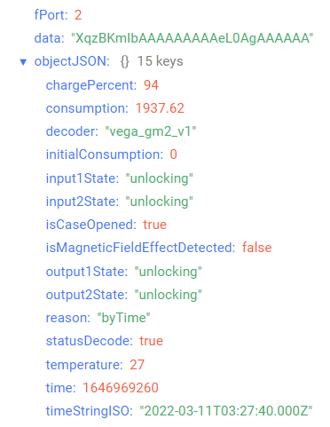

# Вега GM-2 - модем для счетчиков газа Elster

## Описание устройства

LoRaWAN® модем Вега GM-2 предназначен для снятия показаний со счётчиков газа Elster, с последующим накоплением и передачей этой информации в сеть LoRaWAN®.

Модем оснащён двумя датчиками Холла, один из которых осуществляет подсчёт текущих показаний счётчика газа, а другой выполняет функцию антимагнитной пломбы.

Кроме того, на плате модема установлен тампер для контроля вскрытия корпуса. Также имеется два охранных входа и два выхода типа «открытый коллектор» для управления внешними устройствами.

## Описание полей данных

### Пакет с текущими показаниями

Пакет с текущими показаниями приходит на порт 2 и содержит следующие поля:
- `chargePercent` - заряд батареи (%), тип данных `Number`;
- `consumption` - текущие показания (куб.м), тип данных `Number`;
- `decoder` - имя и версия дешифратора, тип данных `String`;
- `initialConsumption` - начальные показания на момент установки радиомодема (куб.м), тип данных `Number`;
- `input1State` - состояние охранного входа 1 (**closure** если вход замкнут и **unlocking** если вход разомкнут), тип данных `String`;
- `input2State` - состояние охранного входа 2 (**closure** если вход замкнут и **unlocking** если вход разомкнут), тип данных `String`;
- `isCaseOpened` - признак вскрытия корпуса (**true** если корпус открыт и **false** если корпус закрыт), тип данных `Boolean`;
- `isMagneticFieldEffectDetected` - наличие воздействия внешнего магнитного поля (**true** если зафиксировано и **false** если не зафиксировано), тип данных `Boolean`;
- `output1State` - состояние дискретного выхода 1 (**closure** если выход замкнут и **unlocking** если выход разомкнут), тип данных `String`;
- `output2State` - состояние дискретного выхода 2 (**closure** если выход замкнут и **unlocking** если выход разомкнут), тип данных `String`;
- `reason` - причина отправки пакета (**byTime** - по времени, **bySecurityInput1Triggered** - по тревоге на входе 1, **bySecurityInput2Triggered** - по тревоге на входе 2, **byOutput1StateChanged** - по изменению состояния выхода 1, **byOutput2StateChanged** - по изменению состояния выхода 2, **byMagneticFieldEffectDetected** - по внешнему магнитному воздействию, **byCaseOpened** - по вскрытию корпуса), тип данных `String`;
- `statusDecode` - состояние расшифровки данных (**true** если расшифровка успешна и **false** если неуспешна), тип данных `Boolean`;
- `temperature` - температура (°С), тип данных `Number`;
- `time` - время снятия показаний, передаваемых в пакете в формате Unix-time (с), тип данных `Number`;
- `timeStringISO` - время снятия показаний, передаваемых в пакете в формате ISO, тип данных `String`.

Пример расшифрованного сообщения:

### Пакет с запросом корректировки времени

Пакет с запросом корректировки времени приходит на порт 4 и содержит следующие поля:
- `decoder` - имя и версия дешифратора, тип данных `String`;
- `statusDecode` - состояние расшифровки данных (**true** если расшифровка успешна и **false** если неуспешна), тип данных `Boolean`;
- `time` - время снятия показаний, передаваемых в пакете в формате Unix-time (с), тип данных `Number`;
- `timeStringISO` - время снятия показаний, передаваемых в пакете в формате ISO, тип данных `String`;
- `type` - тип пакета, тип данных `String`.

Пример расшифрованного сообщения:

### Пакет с настройками

Пакет с настройками приходит на порт 3 и содержит следующие поля:
- `decoder` - имя и версия дешифратора, тип данных `String`;
- `settings` - текущие значения настроек устройства, тип данных `Object` (ключами объекта являются номера параметров);
- `statusDecode` - состояние расшифровки данных (**true** если расшифровка успешна и **false** если неуспешна), тип данных `Boolean`;
- `type` - тип пакета, тип данных `String`.

Объект параметра, содержит следующие поля:
- `id` - номера параметра, тип данных `Number`;
- `length` - длина значения параметра (байт), тип данных `Number`;
- `name` - имя параметра, тип данных `String`;
- `rawValue` - необработанное значение параметра, тип данных `String`;
- `value` - значение параметра, тип данных зависит от параметра.

Пример расшифрованного сообщения:

