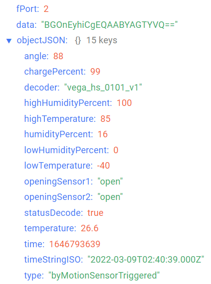
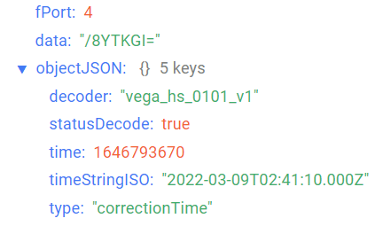
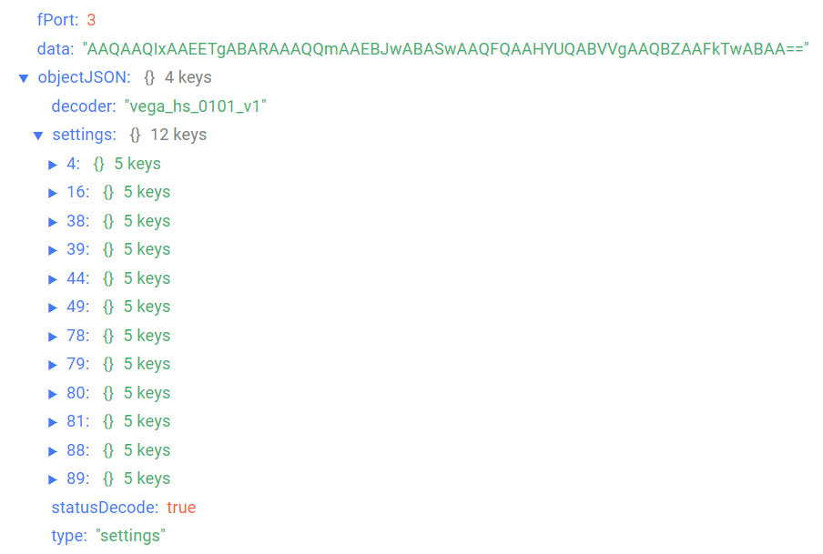

# Vega Smart-HS0101 - sensor of humidity/temperature/door and window/acceleration

## Device description

Vega Smart-HS0101 sensor combines a several functions, namely: door and window sensor, accelerometer, which determines the presence of vibration and the angle of deviation from the vertical, control of temperature and humidity parameters of the environment with the ability to set the ranges of these parameters. Every time alarm event occur, information message will send to LoRaWAN® network.Vega Smart-HS0101 can be used to control premises, buildings and structures, as well as in Smart Home systems, built on LoRaWAN® technology.

## Description of data fields

### Current state packet

Current state packet sent on port 2 and contains the following fields:
- `angle` - sensor deviation angle from vertical (0-90°), data type `Number`;
- `chargePercent` - battery charge (%), data type `Number`;
- `decoder` - name and version of the decoder, data type `String`;
- `highHumidityPercent` - humidity high threshold (%), data type `Number`;
- `highTemperature` - temperature high threshold (°С), data type `Number`;
- `humidityPercent` - humidity (%), data type `Number`;
- `lowHumidityPercent` - humidity low threshold (%), data type `Number`;
- `lowTemperature` - temperature low threshold (°С), data type `Number`;
- `openingSensor1` - opening sensor 1 state (**open**  - if it is open and **close** - if it is close), data type `String`;
- `openingSensor2` - opening sensor 2 state (**open**  - if it is open and **close** - if it is close), data type `String`;
- `statusDecode` - data decode status (**true** if decode is successful and **false** if decode is not successful), data type `Boolean`;
- `temperature` - temperature (°С), data type `Number`;
- `time` - reading time for values in this packet in Unix-time format (sec), data type `Number`;
- `timeStringISO` - reading time for values in this packet in ISO format, data type `String`;
- `type` - packet type, data type `String`.

An example of decoded message:

### Time correction request packet

Time correction request packet sent on port 4 and contains the following fields:
- `decoder` - name and version of the decoder, data type `String`;
- `statusDecode` - data decode status (**true** if decode is successful and **false** if decode is not successful), data type `Boolean`;
- `time` - reading time for values in this packet in Unix-time format (sec), data type `Number`;
- `timeStringISO` - reading time for values in this packet in ISO format, data type `String`;
- `type` - packet type, data type `String`.

An example of decoded message:

### Setting packet

Setting packet sent on port 3 and contains the following fields:
- `decoder` - name and version of the decoder, data type `String`;
- `settings` - current device settings values, data type `Object` (object keys are setting identifiers);
- `statusDecode` - data decode status (**true** if decode is successful and **false** if decode is not successful), data type `Boolean`;
- `type` - packet type, data type `String`.

Setting object contains the following fields:
- `id` - unique identifier for the setting, data type `Number`;
- `length` - setting value length (байт), data type `Number`;
- `name` - setting name, data type `String`;
- `rawValue` - raw setting value, data type `String`;
- `value` - setting value, data type depends on parameter.

An example of decoded message:

