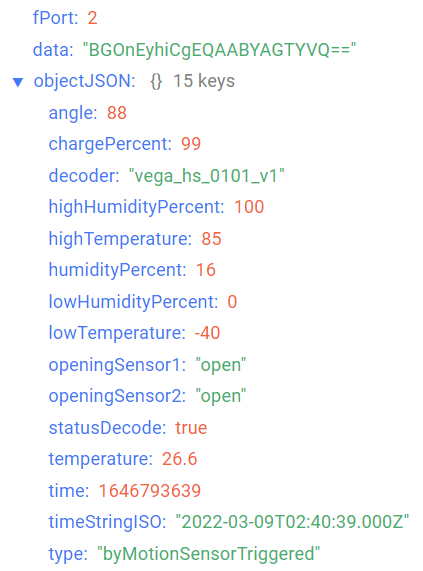
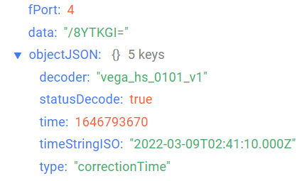
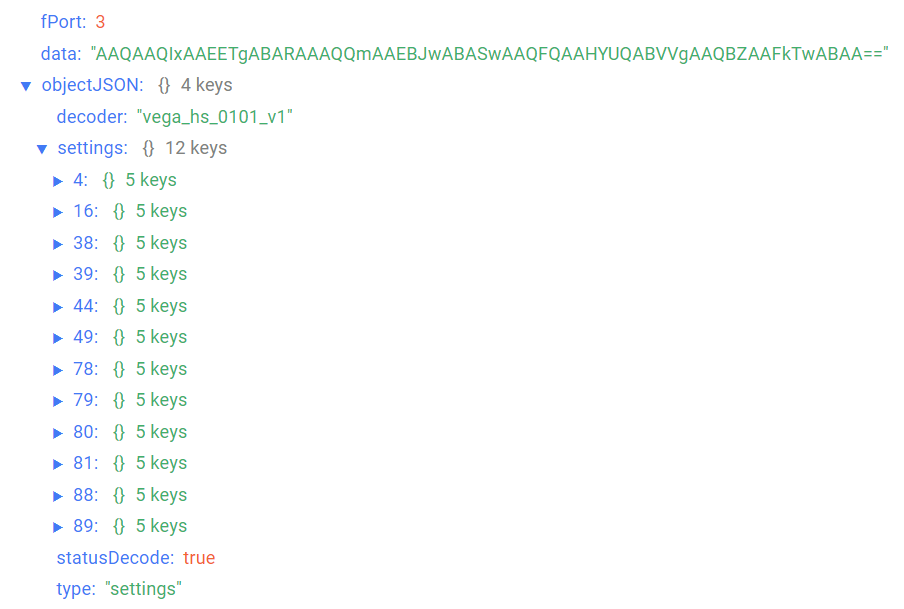

# Вега Smart-HS0101 - датчик влажности/температуры/открытия/ускорения

## Описание устройства

Датчик Вега Smart-HS0101 предназначен для использования в целях удалённого
контроля открывания/закрывания различных дверей и окон, для определения угла
наклона каких-либо объектов или для фиксации факта начала движения, а также для
измерения параметров температуры и влажности, включая контроль выхода этих
параметров из заданного диапазона значений. Все контролируемые параметры могут
быть источником возникновения тревожного события с инициацией внеочередного
сеанса связи и передачей сообщения с кодом тревоги.

## Описание полей данных

### Пакет с текущим состоянием

Пакет с текущим состоянием приходит на порт 2 и содержит следующие поля:
- `angle` - угол отклонения датчика от вертикали (0-90°), тип данных `Number`;
- `chargePercent` - заряд батареи (%), тип данных `Number`;
- `decoder` - имя и версия дешифратора, тип данных `String`;
- `highHumidityPercent` - верхний порог влажности (%), тип данных `Number`;
- `highTemperature` - верхний порог температуры (°С), тип данных `Number`;
- `humidityPercent` - влажность (%), тип данных `Number`;
- `lowHumidityPercent` - нижний порог влажности (%), тип данных `Number`;
- `lowTemperature` - нижний порог температуры (°С), тип данных `Number`;
- `openingSensor1` - состояние датчика открытия 1 (**open**  - если открыто и **close** - если закрыто), тип данных `Boolean`;
- `openingSensor2` - состояние датчика открытия 2 (**open**  - если открыто и **close** - если закрыто), тип данных `Boolean`;
- `statusDecode` - состояние расшифровки данных (**true** если расшифровка успешна и **false** если неуспешна), тип данных `Boolean`;
- `temperature` - температура (°С), тип данных `Number`;
- `time` - время снятия показаний, передаваемых в пакете в формате Unix-time (с), тип данных `Number`;
- `timeStringISO` - время снятия показаний, передаваемых в пакете в формате ISO, тип данных `String`;
- `type` - тип пакета, тип данных `String`.

Пример расшифрованного сообщения:

### Пакет с запросом корректировки времени

Пакет с запросом корректировки времени приходит на порт 4 и содержит следующие поля:
- `decoder` - имя и версия дешифратора, тип данных `String`;
- `statusDecode` - состояние расшифровки данных (**true** если расшифровка успешна и **false** если неуспешна), тип данных `Boolean`;
- `time` - время снятия показаний, передаваемых в пакете в формате Unix-time (с), тип данных `Number`;
- `timeStringISO` - время снятия показаний, передаваемых в пакете в формате ISO, тип данных `String`;
- `type` - тип пакета, тип данных `String`.

Пример расшифрованного сообщения:

### Пакет с настройками

Пакет с настройками приходит на порт 3 и содержит следующие поля:
- `decoder` - имя и версия дешифратора, тип данных `String`;
- `settings` - текущие значения настроек устройства, тип данных `Object` (ключами объекта являются номера параметров);
- `statusDecode` - состояние расшифровки данных (**true** если расшифровка успешна и **false** если неуспешна), тип данных `Boolean`;
- `type` - тип пакета, тип данных `String`.

Объект параметра, содержит следующие поля:
- `id` - номера параметра, тип данных `Number`;
- `length` - длина значения параметра (байт), тип данных `Number`;
- `name` - имя параметра, тип данных `String`;
- `rawValue` - необработанное значение параметра, тип данных `String`;
- `value` - значение параметра, тип данных зависит от параметра.

Пример расшифрованного сообщения:

