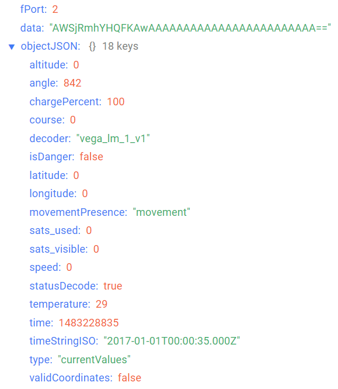
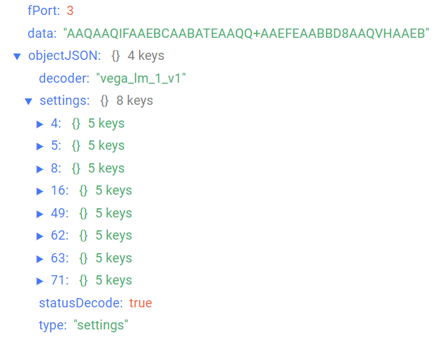

# Vega LM-1 - Tracking device

## Device description

Vega LM-1 tracking is designed to determine the height above sea level, an angle of deviation from the vertical, moving beginning, and the coordinates by GLONASS/GPS satellites inside the local LoRaWAN® network.

Vega LM-1 can determine an angle of deviation from the vertical with high accuracy through built-in three-axis accelerometer. This information may be used for initiating an extraordinary communication session, and also it may be transferred with the standard packet in the LoRaWAN® network.

The housing has magnetic mountings with the neodymium magnets, and also eyelets for mounting straps. IP67 ingress protection rating and operating temperatures from -40 to +70 °С allows to mount device in the cold rooms and outside.

## Description of data fields

### Current state packet

Current state packet sent on port 2 and contains the following fields:
- `altitude` - the height above the sea level (m), data type `Number`;
- `angle` - sensor deviation angle from vertical (0-90°), data type `Number`;
- `chargePercent` - battery charge (%), data type `Number`;
- `course` - course (°), data type `Number`;
- `decoder` - name and version of the decoder, data type `String`;
- `isDanger` - alarm flag (**true** if alarm is detected **false** if alarm is not detected), data type `Boolean`;
- `latitude` - latitude (°), data type `Number`;
- `longitude` - longitude (°), data type `Number`;
- `movementPresence` - movement presence (**movement** if device is moving, **static** if device is not moving);
- `sats_used` - the number of satellites used in navigation decision, data type `Number`;
- `sats_visible` - the number of visible satellites at the packet formed moment, data type `Number`;
- `speed` - speed (km/h), data type `Number`;
- `statusDecode` - data decode status (**true** if decode is successful and **false** if decode is not successful), data type `Boolean`;
- `temperature` - temperature (°С), data type `Number`;
- `time` - reading time for values in this packet in Unix-time format (sec), data type `Number`;
- `timeStringISO` - reading time for values in this packet in ISO format, data type `String`;
- `type` - packet type, data type `String`.

An example of decoded message:

### Time correction request packet

Time correction request packet sent on port 4 and contains the following fields:
- `decoder` - name and version of the decoder, data type `String`;
- `statusDecode` - data decode status (**true** if decode is successful and **false** if decode is not successful), data type `Boolean`;
- `time` - reading time for values in this packet in Unix-time format (sec), data type `Number`;
- `timeStringISO` - reading time for values in this packet in ISO format, data type `String`;
- `type` - packet type, data type `String`.

### Setting packet

Setting packet sent on port 3 and contains the following fields:
- `decoder` - name and version of the decoder, data type `String`;
- `settings` - current device settings values, data type `Object` (object keys are setting identifiers);
- `statusDecode` - data decode status (**true** if decode is successful and **false** if decode is not successful), data type `Boolean`;
- `type` - packet type, data type `String`.

Setting object contains the following fields:
- `id` - unique identifier for the setting, data type `Number`;
- `length` - setting value length (байт), data type `Number`;
- `name` - setting name, data type `String`;
- `rawValue` - raw setting value, data type `String`;
- `value` - setting value, data type depends on parameter.

An example of decoded message:

