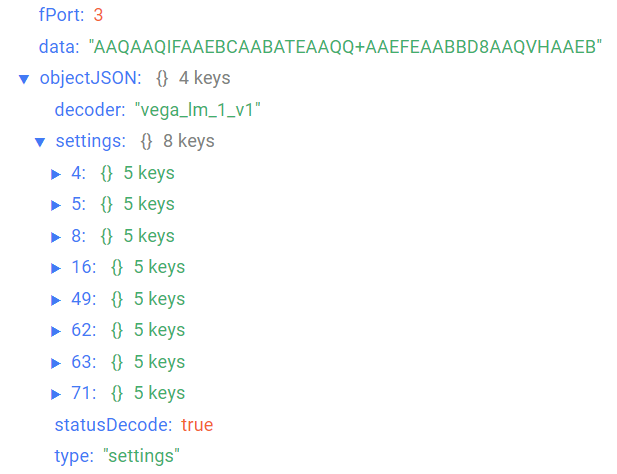

# Вега LM-1 - Поисковое устройство

## Описание устройства

Поисковое устройство Вега LM-1 предназначено для определения своего положения над уровнем моря, начала движения, угла отклонения от вертикали и своих координат по спутникам ГЛОНАСС/GPS, с последующим накоплением и передачей этой информации в сеть LoRaWAN®.

Вега LM-1 способен определять угол отклонения от вертикали с высокой точностью благодаря встроенному трехосевому акселерометру. Эта информация может быть использована устройством для инициации внеочередного сеанса связи, а также передаваться в стандартном пакете в сеть LoRaWAN®.

Корпус имеет магнитные крепления на неодимовые магниты, а также проушины для крепления хомутами. Высокая степень защиты корпуса IP67 и диапазон рабочих температур от -40 до +70 °С позволяют устанавливать устройство в неотапливаемых помещениях и на улице.

## Описание полей данных

### Пакет с текущим состоянием

Пакет с текущим состоянием приходит на порт 2 и содержит следующие поля:
- `altitude` - высота над средним уровнем моря (м), тип данных `Number`;
- `angle` - угол отклонения датчика от вертикали (0-90°), тип данных `Number`;
- `chargePercent` - заряд батареи (%), тип данных `Number`;
- `course` - курс (°), тип данных `Number`;
- `decoder` - имя и версия дешифратора, тип данных `String`;
- `isDanger` - признак тревоги (**true** если зафиксирована тревога и **false** если тревога не зафиксирована), тип данных `Boolean`;
- `latitude` - широта (°), тип данных `Number`;
- `longitude` - долгота (°), тип данных `Number`;
- `movementPresence` - признак наличия движения (**movement** если устройство находится в движении, **static** если устройство находится в состоянии покоя);
- `sats_used` - количество спутников, используемых в навигационном решении, тип данных `Number`;
- `sats_visible` - количество видимых спутников на момент формирования пакета, тип данных `Number`;
- `speed` - скорость (км/ч), тип данных `Number`;
- `statusDecode` - состояние расшифровки данных (**true** если расшифровка успешна и **false** если неуспешна), тип данных `Boolean`;
- `temperature` - температура (°С), тип данных `Number`;
- `time` - время снятия показаний, передаваемых в пакете в формате Unix-time (с), тип данных `Number`;
- `timeStringISO` - время снятия показаний, передаваемых в пакете в формате ISO, тип данных `String`;
- `type` - тип пакета, тип данных `String`.

Пример расшифрованного сообщения:

### Пакет с запросом корректировки времени

Пакет с запросом корректировки времени приходит на порт 4 и содержит следующие поля:
- `decoder` - имя и версия дешифратора, тип данных `String`;
- `statusDecode` - состояние расшифровки данных (**true** если расшифровка успешна и **false** если неуспешна), тип данных `Boolean`;
- `time` - время снятия показаний, передаваемых в пакете в формате Unix-time (с), тип данных `Number`;
- `timeStringISO` - время снятия показаний, передаваемых в пакете в формате ISO, тип данных `String`;
- `type` - тип пакета, тип данных `String`.

### Пакет с настройками

Пакет с настройками приходит на порт 3 и содержит следующие поля:
- `decoder` - имя и версия дешифратора, тип данных `String`;
- `settings` - текущие значения настроек устройства, тип данных `Object` (ключами объекта являются номера параметров);
- `statusDecode` - состояние расшифровки данных (**true** если расшифровка успешна и **false** если неуспешна), тип данных `Boolean`;
- `type` - тип пакета, тип данных `String`.

Объект параметра, содержит следующие поля:
- `id` - номера параметра, тип данных `Number`;
- `length` - длина значения параметра (байт), тип данных `Number`;
- `name` - имя параметра, тип данных `String`;
- `rawValue` - необработанное значение параметра, тип данных `String`;
- `value` - значение параметра, тип данных зависит от параметра.

Пример расшифрованного сообщения:

