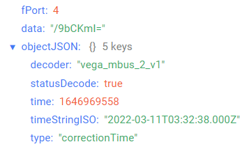
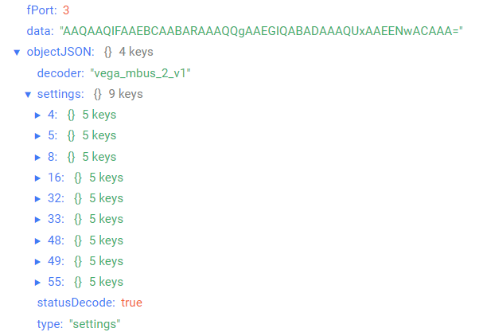

# Vega M-BUS-2 - M-BUS converter

## Device description

The Vega M-BUS-2 converter is designed for reading data from devices with M-BUS interface with subsequent accumulation and transfer of this information via LoRaWAN® protocol to the gateway by means of radio communication at frequencies of the range 860-1000 MHz.

## Description of data fields

### Current state packet

Current state packet sent on port 2 and contains the following fields:
- `chargePercent` - battery charge (%), data type `Number`;
- `currentSettings` - values of current settings, data type `Object`, contains the following fields:
    - `ack` - query for packer confirmation (**true** - on, **false** - off), data type `Boolean`;
    - `connectPeriodMin` - communication period (min), data type `Number`;
    - `typeActivation` - activation type, data type `String`;
- `currentFlowCoolantLH16` - current flow of coolant (l/h) in uint16 format (deprecated field), data type `Number`;
- `currentFlowCoolantLH32` - current flow of coolant (l/h) in uint32 format (actual field), data type `Number`;
- `decoder` - name and version of the decoder, data type `String`;
- `energyConsumedWh` - the amount of thermal energy consumed (Wh), data type `Number`;
- `environment` - environment (water, gas, and etc.), data type `String`;
- `operatingTimeH` - operating time (h), data type `Number`;
- `powerW` - power (W), data type `Number`;
- `serialNumber` - device serial number, data type `Number`;
- `statusDecode` - data decode status (**true** if decode is successful and **false** if decode is not successful), data type `Boolean`;
- `temperatureFlow` - current flow temperature (°С), data type `Number`;
- `temperatureReturnLine` - current temperature in the return line (°С), data type `Number`;
- `totalVolumeCoolantL` - total coolant volume (l), data type `Number`;
- `time` - reading time for values in this packet in Unix-time format (sec), data type `Number`;
- `timeStringISO` - reading time for values in this packet in ISO format, data type `String`;
- `type` - packet type, data type `String`.

### Time correction request packet

Time correction request packet sent on port 4 and contains the following fields:
- `decoder` - name and version of the decoder, data type `String`;
- `statusDecode` - data decode status (**true** if decode is successful and **false** if decode is not successful), data type `Boolean`;
- `time` - reading time for values in this packet in Unix-time format (sec), data type `Number`;
- `timeStringISO` - reading time for values in this packet in ISO format, data type `String`;
- `type` - packet type, data type `String`.

An example of decoded message:

### Setting packet

Setting packet sent on port 3 and contains the following fields:
- `decoder` - name and version of the decoder, data type `String`;
- `settings` - current device settings values, data type `Object` (object keys are setting identifiers);
- `statusDecode` - data decode status (**true** if decode is successful and **false** if decode is not successful), data type `Boolean`;
- `type` - packet type, data type `String`.

Setting object contains the following fields:
- `id` - unique identifier for the setting, data type `Number`;
- `length` - setting value length (байт), data type `Number`;
- `name` - setting name, data type `String`;
- `rawValue` - raw setting value, data type `String`;
- `value` - setting value, data type depends on parameter.

An example of decoded message:

