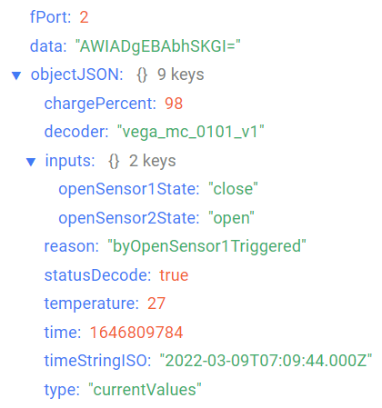
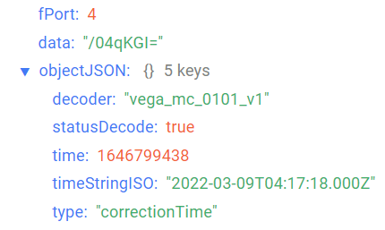
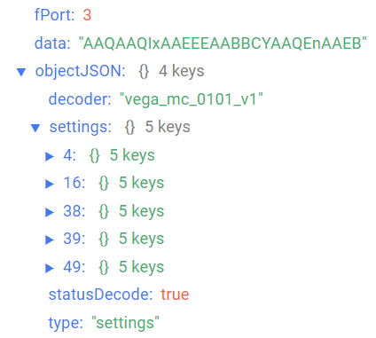

# Vega Smart-MC0101 - door and window sensor

## Device description

The door and window sensor can trigger both opening and closing doors or windows. An alarm packet is sent to the LoRaWAN® network every time it is triggered. Sensors producing in four colors versions and looking organically in any interior.Sensor contains two parts: the main part including all of electronics – there are a board, a battery, the indicators and Hall sensors, but the magnetic part contain only a magnet.The sensor can be used to protect premises, buildings and structures, as well as in Smart Home systems, built on LoRaWAN® technology.

## Description of data fields

### Current state packet

Current state packet sent on port 2 and contains the following fields:
- `chargePercent` - battery charge (%), data type `Number`;
- `decoder` - name and version of the decoder, data type `String`;
- `inputs` - inputs state, data type `Object`, contains the following fields:
    - `openSensor1State` - opening sensor 1 state (**open**  - if it is open and **close** - if it is close), data type `String`;
    - `openSensor2State` - opening sensor 2 state (**open**  - if it is open and **close** - if it is close), data type `String`;
- `reason` - sending reason  (**byTime** - by the time, **byOpenSensor1Triggered** - by the opening sensor 1 triggered, **byOpenSensor2Triggered** - by the opening sensor 2 triggered), data type `String`;
- `statusDecode` - data decode status (**true** if decode is successful and **false** if decode is not successful), data type `Boolean`;
- `temperature` - temperature (°С), data type `Number`;
- `time` - reading time for values in this packet in Unix-time format (sec), data type `Number`;
- `timeStringISO` - reading time for values in this packet in ISO format, data type `String`;
- `type` - packet type, data type `String`.

An example of decoded message:

### Time correction request packet

Time correction request packet sent on port 4 and contains the following fields:
- `decoder` - name and version of the decoder, data type `String`;
- `statusDecode` - data decode status (**true** if decode is successful and **false** if decode is not successful), data type `Boolean`;
- `time` - reading time for values in this packet in Unix-time format (sec), data type `Number`;
- `timeStringISO` - reading time for values in this packet in ISO format, data type `String`;
- `type` - packet type, data type `String`.

An example of decoded message:

### Setting packet

Setting packet sent on port 3 and contains the following fields:
- `decoder` - name and version of the decoder, data type `String`;
- `settings` - current device settings values, data type `Object` (object keys are setting identifiers);
- `statusDecode` - data decode status (**true** if decode is successful and **false** if decode is not successful), data type `Boolean`;
- `type` - packet type, data type `String`.

Setting object contains the following fields:
- `id` - unique identifier for the setting, data type `Number`;
- `length` - setting value length (байт), data type `Number`;
- `name` - setting name, data type `String`;
- `rawValue` - raw setting value, data type `String`;
- `value` - setting value, data type depends on parameter.

An example of decoded message:

