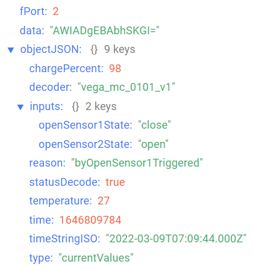
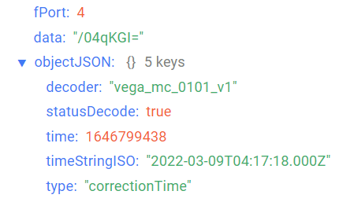
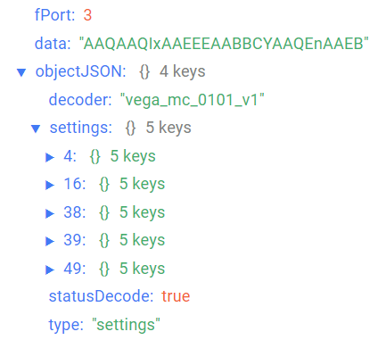

# Вега Smart-MC0101 - магнитоконтактный датчик

## Описание устройства

Магнитоконтактный датчик Вега Smart-MC0101 состоит из двух компонентов, один из которых содержит магнит, а другой — ответную часть с датчиком Холла. Датчик в зависимости от настроек может срабатывать как на открывание, так и на закрывание дверей или окон. При каждом срабатывании в сеть LoRaWAN® отправляется тревожный пакет. Датчики выпускаются в современном пластиковом корпусе в четырёх цветовых исполнениях: чёрный, коричневый, белый и серый.Датчик может применяться для охраны сейфов, помещений, зданий и сооружений, а также в системах «Умный дом», построенных на технологии LoRaWAN®.

## Описание полей данных

### Пакет с текущим состоянием

Пакет с текущим состоянием приходит на порт 2 и содержит следующие поля:
- `chargePercent` - заряд батареи (%), тип данных `Number`;
- `decoder` - имя и версия дешифратора, тип данных `String`;
- `inputs` - состояние входов, тип данных `Object`, содержит следующие поля:
    - `openSensor1State` - состояние датчика открытия 1 (**open** если открыто и **close** если закрыто), тип данных `String`;
    - `openSensor2State` - состояние датчика открытия 2 (**open** если открыто и **close** если закрыто), тип данных `String`;
- `reason` - причина отправки пакета (**byTime** - по времени, **byOpenSensor1Triggered** - сработал датчик открытия 1, **byOpenSensor2Triggered** - сработал датчик открытия 2), тип данных `String`;
- `statusDecode` - состояние расшифровки данных (**true** если расшифровка успешна и **false** если неуспешна), тип данных `Boolean`;
- `temperature` - температура (°С), тип данных `Number`;
- `time` - время снятия показаний, передаваемых в пакете в формате Unix-time (с), тип данных `Number`;
- `timeStringISO` - время снятия показаний, передаваемых в пакете в формате ISO, тип данных `String`;
- `type` - тип пакета, тип данных `String`.

Пример расшифрованного сообщения:

### Пакет с запросом корректировки времени

Пакет с запросом корректировки времени приходит на порт 4 и содержит следующие поля:
- `decoder` - имя и версия дешифратора, тип данных `String`;
- `statusDecode` - состояние расшифровки данных (**true** если расшифровка успешна и **false** если неуспешна), тип данных `Boolean`;
- `time` - время снятия показаний, передаваемых в пакете в формате Unix-time (с), тип данных `Number`;
- `timeStringISO` - время снятия показаний, передаваемых в пакете в формате ISO, тип данных `String`;
- `type` - тип пакета, тип данных `String`.

Пример расшифрованного сообщения:

### Пакет с настройками

Пакет с настройками приходит на порт 3 и содержит следующие поля:
- `decoder` - имя и версия дешифратора, тип данных `String`;
- `settings` - текущие значения настроек устройства, тип данных `Object` (ключами объекта являются номера параметров);
- `statusDecode` - состояние расшифровки данных (**true** если расшифровка успешна и **false** если неуспешна), тип данных `Boolean`;
- `type` - тип пакета, тип данных `String`.

Объект параметра, содержит следующие поля:
- `id` - номера параметра, тип данных `Number`;
- `length` - длина значения параметра (байт), тип данных `Number`;
- `name` - имя параметра, тип данных `String`;
- `rawValue` - необработанное значение параметра, тип данных `String`;
- `value` - значение параметра, тип данных зависит от параметра.

Пример расшифрованного сообщения:

