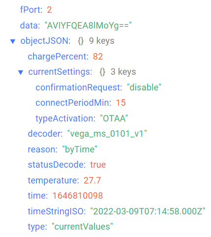
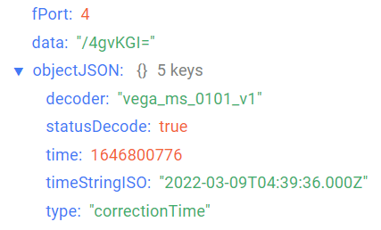
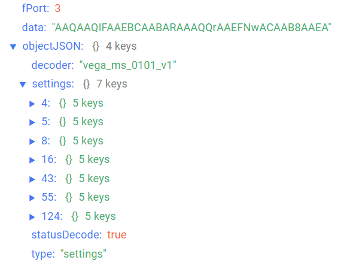

# Vega Smart-MS0101 - motion sensor

## Device description

Infrared motion sensor Vega Smart-MS0101 is designed to detect penetration into the protected area. The sensor alternately operates in two modes: «Guard» and «Neutral». In the «Guard» mode, the device sends an alarm message to the LoRaWAN® network when motion is detected, after which it switches to the «Neutral» mode for a while. In the «Neutral» mode, the sensor does not send alarm messages when motion is detected. If the movement in the protected area has ceased, the device switches back to the «Guard» mode.Vega Smart-MS0101 can be used to protect premises, buildings and structures, as well as in Smart Home systems, built on LoRaWAN® technology.

## Description of data fields

### Current state packet

Current state packet sent on port 2 and contains the following fields:
- `chargePercent` - battery charge (%), data type `Number`;
- `currentSettings` - values of current settings, data type `Object`, contains the following fields:
    - `confirmationRequest` - query for packet confirmation (**enable** - if on, **disable** - if off);
    - `connectPeriodMin` - communication period (min), data type `Number`;
    - `typeActivation` - activation type , data type `String`;
- `decoder` - name and version of the decoder, data type `String`;
- `reason` - sending reason  (**byTime** - by the time, **byAlarm** - by the alarm, **byAutoArming** - by the auto arming), data type `String`;
- `statusDecode` - data decode status (**true** if decode is successful and **false** if decode is not successful), data type `Boolean`;
- `temperature` - temperature (°С), data type `Number`;
- `time` - reading time for values in this packet in Unix-time format (sec), data type `Number`;
- `timeStringISO` - reading time for values in this packet in ISO format, data type `String`;
- `type` - packet type, data type `String`.

An example of decoded message:

### Time correction request packet

Time correction request packet sent on port 4 and contains the following fields:
- `decoder` - name and version of the decoder, data type `String`;
- `statusDecode` - data decode status (**true** if decode is successful and **false** if decode is not successful), data type `Boolean`;
- `time` - reading time for values in this packet in Unix-time format (sec), data type `Number`;
- `timeStringISO` - reading time for values in this packet in ISO format, data type `String`;
- `type` - packet type, data type `String`.

An example of decoded message:

### Setting packet

Setting packet sent on port 3 and contains the following fields:
- `decoder` - name and version of the decoder, data type `String`;
- `settings` - current device settings values, data type `Object` (object keys are setting identifiers);
- `statusDecode` - data decode status (**true** if decode is successful and **false** if decode is not successful), data type `Boolean`;
- `type` - packet type, data type `String`.

Setting object contains the following fields:
- `id` - unique identifier for the setting, data type `Number`;
- `length` - setting value length (байт), data type `Number`;
- `name` - setting name, data type `String`;
- `rawValue` - raw setting value, data type `String`;
- `value` - setting value, data type depends on parameter.

An example of decoded message:

