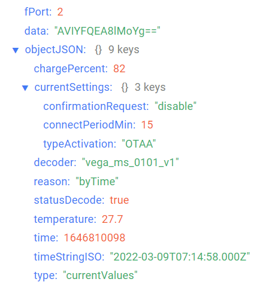
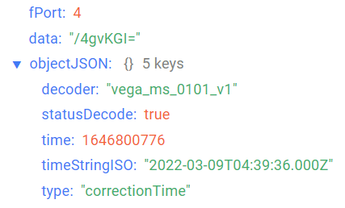
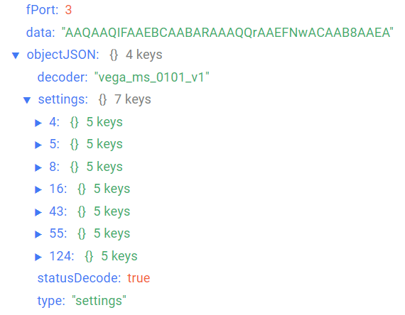

# Вега Smart-MS0101 - датчик движения

## Описание устройства

Инфракрасный датчик движения Вега Smart-MS0101 предназначен для обнаружения проникновения в охраняемую зону.
Датчик попеременно работает в двух режимах: «Охрана» и «Нейтральный».
В режиме «Охрана» устройство отправляет в сеть LoRaWAN® тревожное сообщение при обнаружении движения, после чего на некоторое время переходит в режим «Нейтральный».
В режиме «Нейтральный» датчик не отправляет тревожных сообщений при обнаружении движения. Если движение в охраняемой зоне прекратилось, устройство снова переходит в режим «Охрана».
Вега Smart-MS0101 может применяться для охраны помещений, зданий и сооружений, а также в системах «Умный дом», построенных на технологии LoRaWAN®.

## Описание полей данных

### Пакет с текущим состоянием

Пакет с текущим состоянием приходит на порт 2 и содержит следующие поля:
- `chargePercent` - заряд батареи (%), тип данных `Number`;
- `currentSettings` - значение основных настроек датчика, тип данных `Object`, содержит следующие поля:
    - `confirmationRequest` - запрос на подтвержение пакетов (**enable** - если включен, **disable** - если отключен);
    - `connectPeriodMin` - период выхода на связь (минуты), тип данных `Number`;
    - `typeActivation` - тип активации в сети LoRaWan, тип данных `String`;
- `decoder` - имя и версия дешифратора, тип данных `String`;
- `reason` - причина отправки пакета (**byTime** - по времени, **byAlarm** - по тревоге, **byAutoArming** - по автопостановке на охрану), тип данных `String`;
- `statusDecode` - состояние расшифровки данных (**true** если расшифровка успешна и **false** если неуспешна), тип данных `Boolean`;
- `temperature` - температура (°С), тип данных `Number`;
- `time` - время снятия показаний, передаваемых в пакете в формате Unix-time (с), тип данных `Number`;
- `timeStringISO` - время снятия показаний, передаваемых в пакете в формате ISO, тип данных `String`;
- `type` - тип пакета, тип данных `String`.

Пример расшифрованного сообщения:

### Пакет с запросом корректировки времени

Пакет с запросом корректировки времени приходит на порт 4 и содержит следующие поля:
- `decoder` - имя и версия дешифратора, тип данных `String`;
- `statusDecode` - состояние расшифровки данных (**true** если расшифровка успешна и **false** если неуспешна), тип данных `Boolean`;
- `time` - время снятия показаний, передаваемых в пакете в формате Unix-time (с), тип данных `Number`;
- `timeStringISO` - время снятия показаний, передаваемых в пакете в формате ISO, тип данных `String`;
- `type` - тип пакета, тип данных `String`.

Пример расшифрованного сообщения:

### Пакет с настройками

Пакет с настройками приходит на порт 3 и содержит следующие поля:
- `decoder` - имя и версия дешифратора, тип данных `String`;
- `settings` - текущие значения настроек устройства, тип данных `Object` (ключами объекта являются номера параметров);
- `statusDecode` - состояние расшифровки данных (**true** если расшифровка успешна и **false** если неуспешна), тип данных `Boolean`;
- `type` - тип пакета, тип данных `String`.

Объект параметра, содержит следующие поля:
- `id` - номера параметра, тип данных `Number`;
- `length` - длина значения параметра (байт), тип данных `Number`;
- `name` - имя параметра, тип данных `String`;
- `rawValue` - необработанное значение параметра, тип данных `String`;
- `value` - значение параметра, тип данных зависит от параметра.

Пример расшифрованного сообщения:

