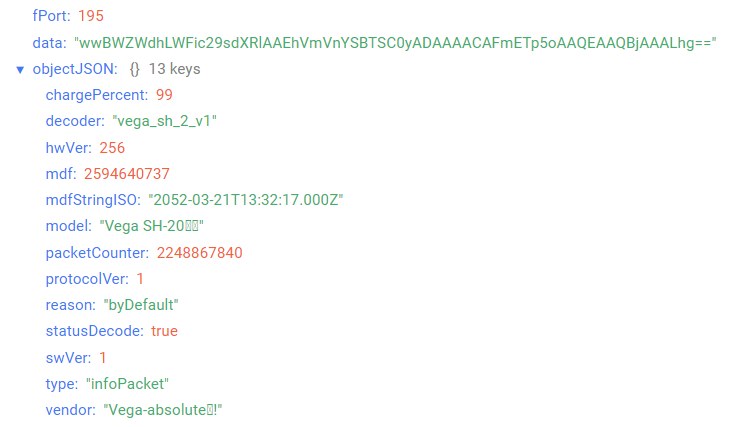

# Vega SH-2 - universal modem

## Device description

Vega SH-2 universal modem is designed for collection the data from external
connected devices, further accumulating and transmitting of this information in the
LoRaWAN® network. The modem has two digital inputs which may be configured as pulse or security.
Besides the device has two analog inputs, 1-Wire and RS-485 interfaces.

## Description of data fields

### Packet with telemetry

Packet with telemetry sent on port 2.
Since the amount of telematic data from the device exceeds the 51 bytes limit of the
LoRaWAN® protocol, the packet is split into sub-packets. In this case, the format of the
subpacket is determined by its first byte type.

Packet with telemetry can contain the following fields:
- `decoder` - name and version of the decoder, data type `String`;
- `standartPacket` - standard subpacket, data type `Object`;
- `timestampPacket` - subpacket timestamp, data type `Object`;
- `oneWirePacket` - subpacket 1-Wire, data type `Object`;
- `modbusPacket` - subpacket ModBus, data type `Object`;
- `statusDecode` - data decode status (**true** if decode is successful and **false** if decode is not successful), data type `Boolean`.

#### _Standard subpacket_
- `chargePercent` - battery charge (%), data type `Number`;
- `pulseInput1State` - input 1 state (depending on operating mode: for pulse - number of pulses, for guard - state (**1** - close, **0** - unclose)), data type `Number`;
- `pulseInput2State` - input 2 state (depending on operating mode: for pulse - number of pulses, for guard - state (**1** - close, **0** - unclose)), data type `Number`;
- `reason` - sending reason  (**byTime** - by the time, **bySecurityInput1Triggered** - by alarm on the input 1, **bySecurityInput2Triggered** - by alarm on the input 2, **byConfiguratorRequest** - by сonfigurator request, **byButtonTriggered** - by pressing the device button), data type `String`;
- `temperature` - temperature (°С), data type `Number`;
- `time` - reading time for values in this packet in Unix-time format (sec), data type `Number`;
- `timeStringISO` - reading time for values in this packet in ISO format, data type `String`;
- `type` - subpacket type, data type `String`;
- `voltageInput1State` - voltage value at analog input 1 (mV), data type `Number`;
- `voltageInput2State` - voltage value at analog input 2 (mV), data type `Number`.

#### _Subpacket timestamp_
- `reason` - sending reason  (**byTime** - by the time, **bySecurityInput1Triggered** - by alarm on the input 1, **bySecurityInput2Triggered** - by alarm on the input 2, **byConfiguratorRequest** - by сonfigurator request, **byButtonTriggered** - by pressing the device button), data type `String`;
- `time` - reading time for values in this packet in Unix-time format (sec), data type `Number`;
- `timeStringISO` - reading time for values in this packet in ISO format, data type `String`;
- `type` - subpacket type, data type `String`.

#### _Subpacket 1-Wire_
- `length` - size of the data (bytes), data type `Number`;
- `temperatureSensors` - data received by temperature sensors via 1-Wire protocol, data type `Object` (ключами объекта являются номера датчиков);
- `type` - subpacket type, data type `String`.

Message object received by temperature sensor via 1-Wire protocol contains the following fields:
- `number` - sensor number, data type `Number`;
- `temperature` - temperature (°С), data type `Number`.

#### _Subpacket ModBus_
- `length` - size of the data (bytes), data type `Number`;
- `modbusData` - data received via ModBus RTU protocol, data type `Object` (object keys are numbers of messages with data);
- `type` - subpacket type, data type `String`.

Message object received via ModBus RTU protocol contains the following fields:
- `data` - raw data received in the message, data type `String`;
- `head` - the head of the message, data type `Object`, contains the following fields:
    - `functionNumber` - the number of reading operation, data type `Number`;
    - `length` - size of the message (bytes), data type `Number`;
- `value` - data received in the message, data type `Number`.

An example of decoded message:

### Time correction request packet

Time correction request packet sent on port 4 and contains the following fields:
- `decoder` - name and version of the decoder, data type `String`;
- `statusDecode` - data decode status (**true** if decode is successful and **false** if decode is not successful), data type `Boolean`;
- `time` - reading time for values in this packet in Unix-time format (sec), data type `Number`;
- `timeStringISO` - reading time for values in this packet in ISO format, data type `String`;
- `type` - packet type, data type `String`.

An example of decoded message:

### Setting packet

Setting packet sent on port 3 and contains the following fields:
- `decoder` - name and version of the decoder, data type `String`;
- `settings` - current device settings values, data type `Object` (object keys are setting identifiers);
- `statusDecode` - data decode status (**true** if decode is successful and **false** if decode is not successful), data type `Boolean`;
- `type` - packet type, data type `String`.

Setting object contains the following fields:
- `id` - unique identifier for the setting, data type `Number`;
- `length` - setting value length (байт), data type `Number`;
- `name` - setting name, data type `String`;
- `rawValue` - raw setting value, data type `String`;
- `value` - setting value, data type depends on parameter.

An example of decoded message:

### Informational packet

Informational packet sent on port 195 and contains the following fields:
- `chargePercent` - battery charge (%), data type `Number`;
- `decoder` - name and version of the decoder, data type `String`;
- `hwVer` - hardware version, data type `Number`;
- `mdf` - firmware date in Unix-time format (sec), data type `Number`;
- `mdfStringISO` - firmware date in ISO format, data type `String`;
- `model` - model name, data type `String`;
- `packetCounter` - the current value of the packet counter, data type `Number`;
- `protocolVer` - protocol version, data type `Number`;
- `reason` - sending reason (**byDefault** - by default, **byRequest** - by request), data type `String`;
- `statusDecode` - data decode status (**true** if decode is successful and **false** if decode is not successful), data type `Boolean`;
- `swVer` - software version, data type `Number`;
- `type` - packet type, data type `String`;
- `vendor` - device manufacturer information, data type `String`;

An example of decoded message:

