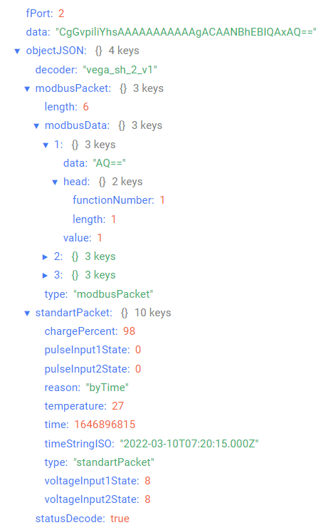
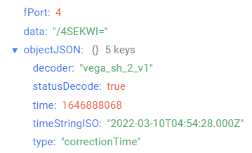
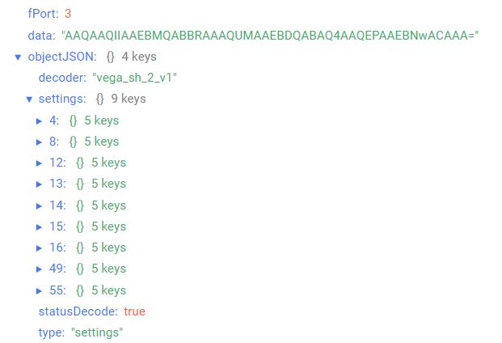
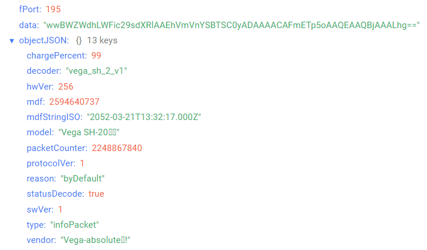

# Вега SH-2 - Универсальный модем

## Описание устройства

Модем может использоваться для подсчёта электрических импульсов, приходящих на 2 независимых входа с последующим накоплением и передачей этой информации в сеть LoRaWAN®. Один или оба импульсных входа могут быть настроены в качестве охранных для выполнения охранной функции. Кроме того, устройство имеет два аналоговых входа, интерфейс 1-Wire и интерфейс RS-485.
Интерфейсы 1-Wire и RS-485 не функционируют одновременно, хотя имеют независимые контактные клеммы. Переключение осуществляется с помощью перемычки на плате и программно.

## Описание полей данных

### Пакет с телеметрией

Пакет с текущим состоянием приходит на порт 2.
Так как объем телематических данных от устройства превышает ограничение
протокола LoRaWAN® в 51 байт, пакет дробится на подпакеты. При этом формат подпакета
определяется его первым байтом type.

Пакет с телеметрией может содержать следующие поля:
- `decoder` - имя и версия дешифратора, тип данных `String`;
- `standartPacket` - стандартный подпакет, тип данных `Object`;
- `timestampPacket` - подпакет timestamp, тип данных `Object`;
- `oneWirePacket` - подпакет 1-Wire, тип данных `Object`;
- `modbusPacket` - подпакет ModBus, тип данных `Object`;
- `statusDecode` - состояние расшифровки данных (**true** если расшифровка успешна и **false** если неуспешна), тип данных `Boolean`.

#### _Стандартный подпакет_
- `chargePercent` - заряд батареи (%), тип данных `Number`;
- `pulseInput1State` - показания на входе 1 (в зависимости от режима работы: для импульсного - количество импульсов, для охранного - состояние (**1** - замкнут, **0** - разомкнут)), тип данных `Number`;
- `pulseInput2State` - показания на входе 2 (в зависимости от режима работы: для импульсного - количество импульсов, для охранного - состояние (**1** - замкнут, **0** - разомкнут)), тип данных `Number`;
- `reason` - причина отправки пакета (**byTime** - по времени, **bySecurityInput1Triggered** - по тревоге на входе 1, **bySecurityInput2Triggered** - по тревоге на входе 2, **byConfiguratorRequest** - по команде конфигуратора, **byButtonTriggered** - по нажатию на кнопку устройства), тип данных `String`;
- `temperature` - температура (°С), тип данных `Number`;
- `time` - время снятия показаний, передаваемых в пакете в формате Unix-time (с), тип данных `Number`;
- `timeStringISO` - время снятия показаний, передаваемых в пакете в формате ISO, тип данных `String`;
- `type` - тип подпакета, тип данных `String`;
- `voltageInput1State` - значение напряжения на аналоговом входе 1 (мВ), тип данных `Number`;
- `voltageInput2State` - значение напряжения на аналоговом входе 2 (мВ), тип данных `Number`.

#### _Подпакет timestamp_
- `reason` - причина отправки пакета (**byTime** - по времени, **bySecurityInput1Triggered** - по тревоге на входе 1, **bySecurityInput2Triggered** - по тревоге на входе 2, **byConfiguratorRequest** - по команде конфигуратора, **byButtonTriggered** - по нажатию на кнопку устройства), тип данных `String`;
- `time` - время снятия показаний, передаваемых в пакете в формате Unix-time (с), тип данных `Number`;
- `timeStringISO` - время снятия показаний, передаваемых в пакете в формате ISO, тип данных `String`;
- `type` - тип пакета, тип данных `String`.

#### _Подпакет 1-Wire_
- `length` - размер данных (байт), тип данных `Number`;
- `temperatureSensors` - данные, полученные датчиков температуры по протоколу 1-Wire, тип данных `Object` (ключами объекта являются номера датчиков);
- `type` - тип подпакета, тип данных `String`.

Объект сообщения с данными, полученными от датчика температуры по протоколу 1-Wire, содержит следующие поля:
- `number` - номер датчика, тип данных `Number`;
- `temperature` - температура (°С), тип данных `Number`.

#### _Подпакет ModBus_
- `length` - размер данных (байт), тип данных `Number`;
- `modbusData` - данные, полученные по протоколу ModBus RTU, тип данных `Object` (ключами объекта являются номера сообщений с данными);
- `type` - тип подпакета, тип данных `String`.

Объект сообщения с данными, полученными по протоколу ModBus RTU, содержит следующие поля:
- `data` - необработанные данные полученные в сообщении, тип данных `String`;
- `head` - заголовок сообщения, тип данных `Object`, содержит следующие поля:
    - `functionNumber` - номер операции чтения, тип данных `Number`;
    - `length` - длина сообщения (байт), тип данных `Number`;
- `value` - данные полученные в сообщении, тип данных `Number`.

Пример расшифрованного сообщения:

### Пакет с запросом корректировки времени

Пакет с запросом корректировки времени приходит на порт 4 и содержит следующие поля:
- `decoder` - имя и версия дешифратора, тип данных `String`;
- `statusDecode` - состояние расшифровки данных (**true** если расшифровка успешна и **false** если неуспешна), тип данных `Boolean`;
- `time` - время снятия показаний, передаваемых в пакете в формате Unix-time (с), тип данных `Number`;
- `timeStringISO` - время снятия показаний, передаваемых в пакете в формате ISO, тип данных `String`;
- `type` - тип пакета, тип данных `String`.

Пример расшифрованного сообщения:

### Пакет с настройками

Пакет с настройками приходит на порт 3 и содержит следующие поля:
- `decoder` - имя и версия дешифратора, тип данных `String`;
- `settings` - текущие значения настроек устройства, тип данных `Object` (ключами объекта являются номера параметров);
- `statusDecode` - состояние расшифровки данных (**true** если расшифровка успешна и **false** если неуспешна), тип данных `Boolean`;
- `type` - тип пакета, тип данных `String`.

Объект параметра, содержит следующие поля:
- `id` - номера параметра, тип данных `Number`;
- `length` - длина значения параметра (байт), тип данных `Number`;
- `name` - имя параметра, тип данных `String`;
- `rawValue` - необработанное значение параметра, тип данных `String`;
- `value` - значение параметра, тип данных зависит от параметра.

Пример расшифрованного сообщения:

### Информационный пакет

Информационный пакет приходит на порт 195 и содержит следующие поля:
- `chargePercent` - заряд батареи (%), тип данных `Number`;
- `decoder` - имя и версия дешифратора, тип данных `String`;
- `hwVer` - аппаратная версия, тип данных `Number`;
- `mdf` - дата ПО в формате Unix-time (с), тип данных `Number`;
- `mdfStringISO` - дата ПО в формате ISO, тип данных `String`;
- `model` - наименование модели, тип данных `String`;
- `packetCounter` - текущее значение счетчика пакетов, тип данных `Number`;
- `protocolVer` - версия протокола, тип данных `Number`;
- `reason` - причина отправки пакета (**byDefault** - по умолчанию, **byRequest** - по запросу), тип данных `String`;
- `statusDecode` - состояние расшифровки данных (**true** если расшифровка успешна и **false** если неуспешна), тип данных `Boolean`;
- `swVer` - программная версия, тип данных `Number`;
- `type` - тип пакета, тип данных `String`;
- `vendor` - информация о производителе устройства, тип данных `String`.

Пример расшифрованного сообщения:

