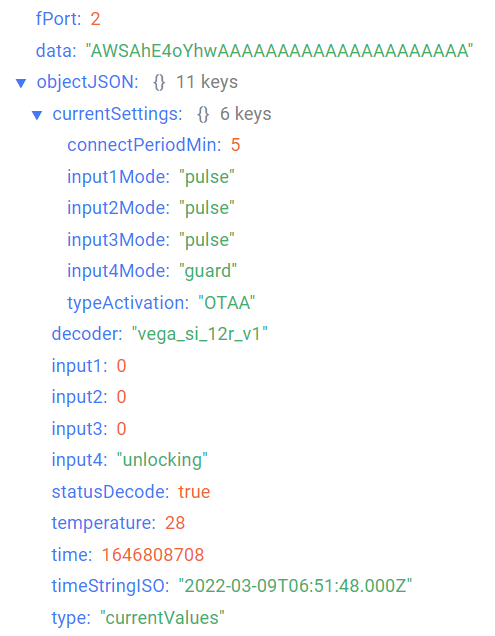
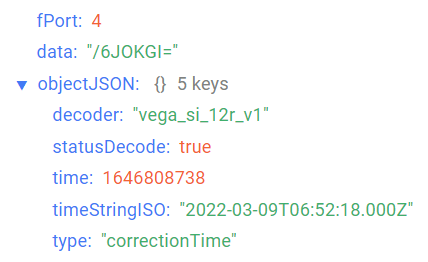
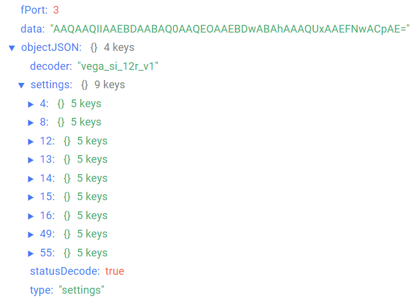

# Вега СИ-12 Реле - счетчик импульсов со встроенным реле

## Описание устройства

Счетчик импульсов Вега СИ-12 Реле предназначен для выполнения счета импульсов, приходящих на 4 независимых входа, с последующим накоплением и передачей этой информации в сеть LoRaWAN®, а также для управления маломощными исполнительными устройствами посредством встроенных реле.
Также устройство Вега СИ-12 Реле может применяться в качестве охранного блока, - все его входы могут быть настроены на использование в качестве охранных.
Счетчик имеет два выхода реле и может использоваться в качестве устройства управления.
Счетчик импульсов может быть использован на приборах учета коммунальных ресурсов и промышленном оборудовании с выходом типа геркон (сухой контакт) или открытый коллектор.

## Описание полей данных

### Пакет с текущим состоянием

Пакет с текущим состоянием приходит на порт 2 и содержит следующие поля:
- `currentSettings` - значение основных настроек датчика, тип данных `Object`, содержит следующие поля:
    - `connectPeriodMin` - период выхода на связь (минуты), тип данных `Number`;
    - `input1Mode` - режим работы входа 1 (**pulse** - импульсный, **guard** - охранный);
    - `input2Mode` - режим работы входа 2 (**pulse** - импульсный, **guard** - охранный);
    - `input3Mode` - режим работы входа 3 (**pulse** - импульсный, **guard** - охранный);
    - `input4Mode` - режим работы входа 4 (**pulse** - импульсный, **guard** - охранный);
    - `typeActivation` - тип активации в сети LoRaWan, тип данных `String`;
- `decoder` - имя и версия дешифратора, тип данных `String`;
- `input1` - показания на входе 1 (в зависимости от режима работы: для импульсного - количество импульсов, тип данных `Number`; для охранного - состояние (**closure** - замкнут, **unlocking** - разомкнут), тип данных `String`);
- `input2` - показания на входе 2 (в зависимости от режима работы: для импульсного - количество импульсов, тип данных `Number`; для охранного - состояние (**closure** - замкнут, **unlocking** - разомкнут), тип данных `String`);
- `input3` - показания на входе 3 (в зависимости от режима работы: для импульсного - количество импульсов, тип данных `Number`; для охранного - состояние (**closure** - замкнут, **unlocking** - разомкнут), тип данных `String`);
- `input4` - показания на входе 4 (в зависимости от режима работы: для импульсного - количество импульсов, тип данных `Number`; для охранного - состояние (**closure** - замкнут, **unlocking** - разомкнут), тип данных `String`);
- `statusDecode` - состояние расшифровки данных (**true** если расшифровка успешна и **false** если неуспешна), тип данных `Boolean`;
- `temperature` - температура (°С), тип данных `Number`;
- `time` - время снятия показаний, передаваемых в пакете в формате Unix-time (с), тип данных `Number`;
- `timeStringISO` - время снятия показаний, передаваемых в пакете в формате ISO, тип данных `String`;
- `type` - тип пакета, тип данных `String`.

Пример расшифрованного сообщения:

### Пакет с запросом корректировки времени

Пакет с запросом корректировки времени приходит на порт 4 и содержит следующие поля:
- `decoder` - имя и версия дешифратора, тип данных `String`;
- `statusDecode` - состояние расшифровки данных (**true** если расшифровка успешна и **false** если неуспешна), тип данных `Boolean`;
- `time` - время снятия показаний, передаваемых в пакете в формате Unix-time (с), тип данных `Number`;
- `timeStringISO` - время снятия показаний, передаваемых в пакете в формате ISO, тип данных `String`;
- `type` - тип пакета, тип данных `String`.

Пример расшифрованного сообщения:

### Пакет с настройками

Пакет с настройками приходит на порт 3 и содержит следующие поля:
- `decoder` - имя и версия дешифратора, тип данных `String`;
- `settings` - текущие значения настроек устройства, тип данных `Object` (ключами объекта являются номера параметров);
- `statusDecode` - состояние расшифровки данных (**true** если расшифровка успешна и **false** если неуспешна), тип данных `Boolean`;
- `type` - тип пакета, тип данных `String`.

Объект параметра, содержит следующие поля:
- `id` - номера параметра, тип данных `Number`;
- `length` - длина значения параметра (байт), тип данных `Number`;
- `name` - имя параметра, тип данных `String`;
- `rawValue` - необработанное значение параметра, тип данных `String`;
- `value` - значение параметра, тип данных зависит от параметра.

Пример расшифрованного сообщения:

