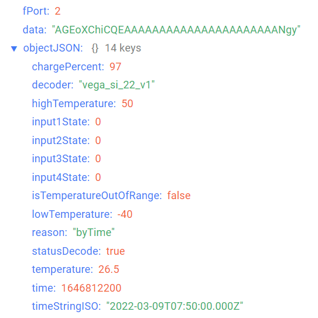
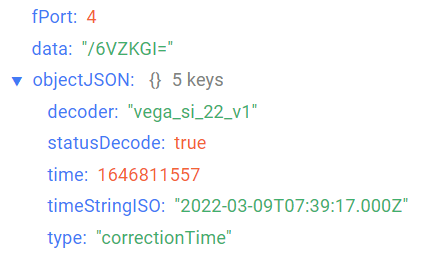

# Vega SI-22 - pulse counter with external antenna

## Device description

Vega SI-22 pulse counter is designed for counting of pulses incoming to 4 independent
inputs, further accumulating and transmitting of this information in the LoRaWAN® network.
In addition, Vega SI-22 can be used as a security device - pulse inputs can be
configured as security inputs.
he pulse counter can check the specified temperature range. When configuring the
device, you can set the low and high thresholds for permissible temperature values. When the
temperature value goes beyond the range, the modem starts an extraordinary
communication session. The data collection period for operation within the temperature
range and outside is configurable separately.
The pulse counter can be used for any utilities’ meters and industrial equipment with
pulse output of herkon type or open-drain type contact.

## Description of data fields

### Current state packet

Current state packet sent on port 2 and contains the following fields:
- `chargePercent` - battery charge (%), data type `Number`;
- `decoder` - name and version of the decoder, data type `String`;
- `highTemperature` - temperature high threshold (°С), data type `Number`;
- `input1` - input 1 state (depending on operating mode: for pulse - number of pulses, for guard - state (**1** - close, **0** - unclose)), data type `Number`;
- `input2` - input 2 state (depending on operating mode: for pulse - number of pulses, for guard - state (**1** - close, **0** - unclose)), data type `Number`;
- `input3` - input 3 state (depending on operating mode: for pulse - number of pulses, for guard - state (**1** - close, **0** - unclose)), data type `Number`;
- `input4` - input 4 state (depending on operating mode: for pulse - number of pulses, for guard - state (**1** - close, **0** - unclose)), data type `Number`;
- `isTemperatureOutOfRange` - temperature is out of range (**true** - if current temperature is out of range, **false** - if current temperature is not out of range), data type `Boolean`;
- `lowTemperature` - temperature low threshold (°С), data type `Number`;
- `reason` - sending reason (**byTime** - by the time, **bySecurityInput1Triggered** - by alarm on the input 1, **bySecurityInput2Triggered** - by alarm on the input 2, **bySecurityInput3Triggered** - by alarm on the input 3, **bySecurityInput4Triggered** - by alarm on the input 4, **byTemperatureOutOfRange** - by the temperature went out of range), data type `String`;
- `statusDecode` - data decode status (**true** if decode is successful and **false** if decode is not successful), data type `Boolean`;
- `temperature` - temperature (°С), data type `Number`;
- `time` - reading time for values in this packet in Unix-time format (sec), data type `Number`;
- `timeStringISO` - reading time for values in this packet in ISO format, data type `String`;
- `type` - packet type, data type `String`.

An example of decoded message:

### Time correction request packet

Time correction request packet sent on port 4 and contains the following fields:
- `decoder` - name and version of the decoder, data type `String`;
- `statusDecode` - data decode status (**true** if decode is successful and **false** if decode is not successful), data type `Boolean`;
- `time` - reading time for values in this packet in Unix-time format (sec), data type `Number`;
- `timeStringISO` - reading time for values in this packet in ISO format, data type `String`;
- `type` - packet type, data type `String`.

An example of decoded message:

### Setting packet

Setting packet sent on port 3 and contains the following fields:
- `decoder` - name and version of the decoder, data type `String`;
- `settings` - current device settings values, data type `Object` (object keys are setting identifiers);
- `statusDecode` - data decode status (**true** if decode is successful and **false** if decode is not successful), data type `Boolean`;
- `type` - packet type, data type `String`.

Setting object contains the following fields:
- `id` - unique identifier for the setting, data type `Number`;
- `length` - setting value length (байт), data type `Number`;
- `name` - setting name, data type `String`;
- `rawValue` - raw setting value, data type `String`;
- `value` - setting value, data type depends on parameter.