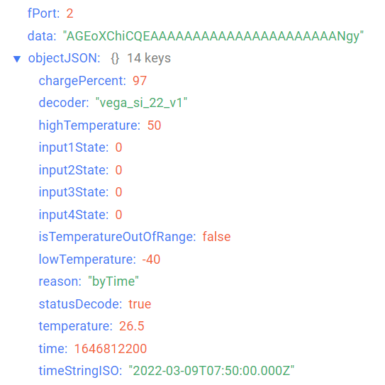

# Вега СИ-22 - счётчик импульсов с внешней антенной

## Описание устройства

Счётчик импульсов Вега СИ-22 предназначен для выполнения подсчёта электрических импульсов, приходящих на 4 независимых входа, с последующим накоплением и передачей этой информации в сеть LoRaWAN®.
Особенностями данной модели являются внешняя антенна LoRaWAN® и высокая степень защиты корпуса - IP67. А возможность подключения внешнего температурного датчика (не входит в комплект поставки) позволяет использовать Вега СИ-22 для снятия температурных показаний.
Счётчик импульсов может быть использован для сбора показаний с приборов учета коммунальных ресурсов и промышленного оборудования с импульсным выходом, таких как водосчётчики, электросчётчики, теплосчётчики, расходомеры.
Элементом питания для счетчика служит батарея SAFT ёмкостью 3600 мАч.
Также устройство Вега СИ-22 может применяться в качестве охранного датчика. Любые из четырёх импульсных входов могут быть настроены в качестве охранных.

## Описание полей данных

### Пакет с текущим состоянием

Пакет с текущим состоянием приходит на порт 2 и содержит следующие поля:
- `chargePercent` - заряд батареи (%), тип данных `Number`;
- `decoder` - имя и версия дешифратора, тип данных `String`;
- `highTemperature` - верхний порог температуры (°С), тип данных `Number`;
- `input1` - показания на входе 1 (в зависимости от режима работы: для импульсного - количество импульсов, для охранного - состояние (**1** - замкнут, **0** - разомкнут)), тип данных `Number`;
- `input2` - показания на входе 2 (в зависимости от режима работы: для импульсного - количество импульсов, для охранного - состояние (**1** - замкнут, **0** - разомкнут)), тип данных `Number`;
- `input3` - показания на входе 3 (в зависимости от режима работы: для импульсного - количество импульсов, для охранного - состояние (**1** - замкнут, **0** - разомкнут)), тип данных `Number`;
- `input4` - показания на входе 4 (в зависимости от режима работы: для импульсного - количество импульсов, для охранного - состояние (**1** - замкнут, **0** - разомкнут)), тип данных `Number`;
- `isTemperatureOutOfRange` - выход температуры за установленные пределы (**true** - если текущая температура не входит в допустимый диапазон, **false** - если текущая температура входит в допустимый диапазон), тип данных `Boolean`;
- `lowTemperature` - нижний порог температуры (°С), тип данных `Number`;
- `reason` - причина отправки пакета (**byTime** - по времени, **bySecurityInput1Triggered** - по срабатыванию охранного входа 1, **bySecurityInput2Triggered** - по срабатыванию охранного входа 2, **bySecurityInput3Triggered** - по срабатыванию охранного входа 3, **bySecurityInput4Triggered** - по срабатыванию охранного входа 4, **byTemperatureOutOfRange** - по выходу температуры за допустимые пределы), тип данных `String`;
- `statusDecode` - состояние расшифровки данных (**true** если расшифровка успешна и **false** если неуспешна), тип данных `Boolean`;
- `temperature` - температура (°С), тип данных `Number`;
- `time` - время снятия показаний, передаваемых в пакете в формате Unix-time (с), тип данных `Number`;
- `timeStringISO` - время снятия показаний, передаваемых в пакете в формате ISO, тип данных `String`;
- `type` - тип пакета, тип данных `String`.

Пример расшифрованного сообщения:

### Пакет с запросом корректировки времени

Пакет с запросом корректировки времени приходит на порт 4 и содержит следующие поля:
- `decoder` - имя и версия дешифратора, тип данных `String`;
- `statusDecode` - состояние расшифровки данных (**true** если расшифровка успешна и **false** если неуспешна), тип данных `Boolean`;
- `time` - время снятия показаний, передаваемых в пакете в формате Unix-time (с), тип данных `Number`;
- `timeStringISO` - время снятия показаний, передаваемых в пакете в формате ISO, тип данных `String`;
- `type` - тип пакета, тип данных `String`.

Пример расшифрованного сообщения:

### Пакет с настройками

Пакет с настройками приходит на порт 3 и содержит следующие поля:
- `decoder` - имя и версия дешифратора, тип данных `String`;
- `settings` - текущие значения настроек устройства, тип данных `Object` (ключами объекта являются номера параметров);
- `statusDecode` - состояние расшифровки данных (**true** если расшифровка успешна и **false** если неуспешна), тип данных `Boolean`;
- `type` - тип пакета, тип данных `String`.

Объект параметра, содержит следующие поля:
- `id` - номера параметра, тип данных `Number`;
- `length` - длина значения параметра (байт), тип данных `Number`;
- `name` - имя параметра, тип данных `String`;
- `rawValue` - необработанное значение параметра, тип данных `String`;
- `value` - значение параметра, тип данных зависит от параметра.