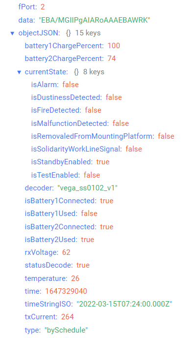
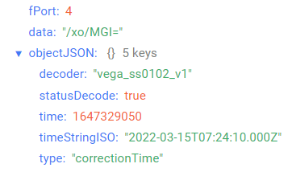

# Vega Smart-SS0102 - smoke sensor

## Device description

Smoke sensor Vega Smart-SS0102 is designed to detect smoke in the protected area. The sensor registers smoke particles by the electro optic method and provides light and sound alarm indication. The sensor also sends a status packet to the LoRaWAN® network.
Vega Smart-SS0102 can be used to protect premises, buildings and structures, as well as in Smart Home systems, built on LoRaWAN® technology.
This equipment cannot be used to create and operate fire-fighting systems.

## Description of data fields

### Current state packet

Current state packet sent on port 2 and contains the following fields:
- `battery1ChargePercent` - battery 1 charge 1 (%), data type `Number`;
- `battery2ChargePercent` - battery 2 charge (%), data type `Number`;
- `currentState` - current state, data type `Object`, contains the following fields:
    - `isAlarm` - alarm (**true** - if detected and **false** - if not detected), data type `Boolean`;
    - `isDustinessDetected` - dustiness (**true** - if detected and **false** - if not detected), data type `Boolean`;
    - `isFireDetected` - fire (**true** - if detected and **false** - if not detected), data type `Boolean`;
    - `isMalfunctionDetected` - malfunction (**true** - if detected and **false** - if not detected), data type `Boolean`;
    - `isRemovaledFromMountingPlatform` - removal from mounting platform (**true** - if detected and **false** - if not detected), data type `Boolean`;
    - `isSolidarityWorkLineSignal` - signal through the line of solidarity work (**true** - if detected and **false** - if not detected), data type `Boolean`;
    - `isStandbyEnabled` - standby mode (**true** - if enabled and **false** - if not enabled), data type `Boolean`;
    - `isTestEnabled` - test mode (**true** - if enabled and **false** - if not enabled), data type `Boolean`;
- `decoder` - name and version of the decoder, data type `String`;
- `isBattery1Connected` - presence of battery 1 (**true** - if present and **false** - if not present), data type `Boolean`;
- `isBattery1Used:` - battery 1 usage (**true** - if used and **false** - if not used), data type `Boolean`;
- `isBattery2Connected` - presence of battery 2 (**true** - if present and **false** - if not present), data type `Boolean`;
- `isBattery2Used` - battery 2 usage (**true** - if used and **false** - if not used), data type `Boolean`;
- `rxVoltage` - receiver voltage (mV), data type `Number`;
- `statusDecode` - data decode status (**true** if decode is successful and **false** if decode is not successful), data type `Boolean`;
- `temperature` - temperature (°С), data type `Number`;
- `time` - reading time for values in this packet in Unix-time format (sec), data type `Number`;
- `timeStringISO` - reading time for values in this packet in ISO format, data type `String`;
- `txCurrent` - transmitter current (mA), data type `Number`;
- `type` - packet type, data type `String`.

An example of decoded message:

### Time correction request packet

Time correction request packet sent on port 4 and contains the following fields:
- `decoder` - name and version of the decoder, data type `String`;
- `statusDecode` - data decode status (**true** if decode is successful and **false** if decode is not successful), data type `Boolean`;
- `time` - reading time for values in this packet in Unix-time format (sec), data type `Number`;
- `timeStringISO` - reading time for values in this packet in ISO format, data type `String`;
- `type` - packet type, data type `String`.

An example of decoded message:

### Setting packet

Setting packet sent on port 3 and contains the following fields:
- `decoder` - name and version of the decoder, data type `String`;
- `settings` - current device settings values, data type `Object` (object keys are setting identifiers);
- `statusDecode` - data decode status (**true** if decode is successful and **false** if decode is not successful), data type `Boolean`;
- `type` - packet type, data type `String`.

Setting object contains the following fields:
- `id` - unique identifier for the setting, data type `Number`;
- `length` - setting value length (байт), data type `Number`;
- `name` - setting name, data type `String`;
- `rawValue` - raw setting value, data type `String`;
- `value` - setting value, data type depends on parameter.

An example of decoded message:

