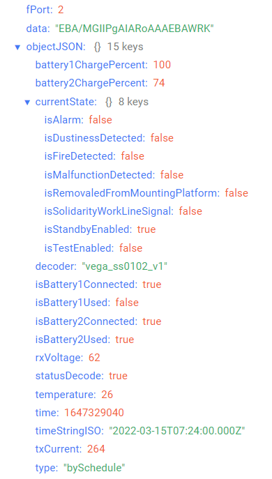
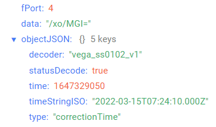
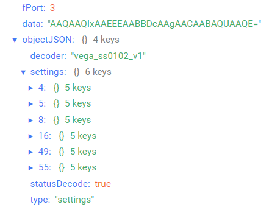

# Вега Smart-SS0102 - датчик дыма

## Описание устройства

Датчик дыма Вега Smart-SS0102 предназначен для обнаружения задымления в охраняемой зоне. Датчик регистрирует частицы дыма оптико-электронным методом и обеспечивает оповещение световой и звуковой индикацией, а также отправляет информацию о своем состоянии в сеть LoRaWAN®.
Вега Smart-SS0102 может применяться для охраны помещений, зданий и сооружений, а также в системах «Умный дом», построенных на технологии LoRaWAN®.
Данное оборудование не может быть использовано для создания и эксплуатации противопожарных систем.

## Описание полей данных

### Пакет с текущим состоянием

Пакет с текущим состоянием приходит на порт 2 и содержит следующие поля:
- `battery1ChargePercent` - заряд батареи 1 (%), тип данных `Number`;
- `battery2ChargePercent` - заряд батареи 2 (%), тип данных `Number`;
- `currentState` - текущий статус, тип данных `Object`, содержит следующие поля:
    - `isAlarm` - тревога (**true** - если зафиксирована и **false** - если не зафиксирована), тип данных `Boolean`;
    - `isDustinessDetected` - запыленность (**true** - если зафиксирована и **false** - если не зафиксирована), тип данных `Boolean`;
    - `isFireDetected` - пожар (**true** - если зафиксирован и **false** - если не зафиксирован), тип данных `Boolean`;
    - `isMalfunctionDetected` - неисправность (**true** - если зафиксирована и **false** - если не зафиксирована), тип данных `Boolean`;
    - `isRemovaledFromMountingPlatform` - снятие с крепежной платформы (**true** - если зафиксировано и **false** - если не зафиксировано), тип данных `Boolean`;
    - `isSolidarityWorkLineSignal` - сигнал по линии солидарной работы (**true** - если есть и **false** - если нет), тип данных `Boolean`;
    - `isStandbyEnabled` - дежурный режим (**true** - если включен и **false** - если отключен), тип данных `Boolean`;
    - `isTestEnabled` - тестовый режим (**true** - если включен и **false** - если отключен), тип данных `Boolean`;
- `decoder` - имя и версия дешифратора, тип данных `String`;
- `isBattery1Connected` - наличие батареи 1 (**true** - если присутствует и **false** - если отсутствует), тип данных `Boolean`;
- `isBattery1Used:` - использование батареи 1 (**true** - если используется и **false** - если не используется), тип данных `Boolean`;
- `isBattery2Connected` - наличие батареи 2 (**true** - если присутствует и **false** - если отсутствует), тип данных `Boolean`;
- `isBattery2Used` - использование батареи 2 (**true** - если используется и **false** - если не используется), тип данных `Boolean`;
- `rxVoltage` - напряжение приемника (мВ), тип данных `Number`;
- `statusDecode` - состояние расшифровки данных (**true** если расшифровка успешна и **false** если неуспешна), тип данных `Boolean`;
- `temperature` - температура (°С), тип данных `Number`;
- `time` - время снятия показаний, передаваемых в пакете в формате Unix-time (с), тип данных `Number`;
- `timeStringISO` - время снятия показаний, передаваемых в пакете в формате ISO, тип данных `String`;
- `txCurrent` - ток передатчика (мА), тип данных `Number`;
- `type` - тип пакета, тип данных `String`.

Пример расшифрованного сообщения:

### Пакет с запросом корректировки времени

Пакет с запросом корректировки времени приходит на порт 4 и содержит следующие поля:
- `decoder` - имя и версия дешифратора, тип данных `String`;
- `statusDecode` - состояние расшифровки данных (**true** если расшифровка успешна и **false** если неуспешна), тип данных `Boolean`;
- `time` - время снятия показаний, передаваемых в пакете в формате Unix-time (с), тип данных `Number`;
- `timeStringISO` - время снятия показаний, передаваемых в пакете в формате ISO, тип данных `String`;
- `type` - тип пакета, тип данных `String`.

Пример расшифрованного сообщения:

### Пакет с настройками

Пакет с настройками приходит на порт 3 и содержит следующие поля:
- `decoder` - имя и версия дешифратора, тип данных `String`;
- `settings` - текущие значения настроек устройства, тип данных `Object` (ключами объекта являются номера параметров);
- `statusDecode` - состояние расшифровки данных (**true** если расшифровка успешна и **false** если неуспешна), тип данных `Boolean`;
- `type` - тип пакета, тип данных `String`.

Объект параметра, содержит следующие поля:
- `id` - номера параметра, тип данных `Number`;
- `length` - длина значения параметра (байт), тип данных `Number`;
- `name` - имя параметра, тип данных `String`;
- `rawValue` - необработанное значение параметра, тип данных `String`;
- `value` - значение параметра, тип данных зависит от параметра.

Пример расшифрованного сообщения:

