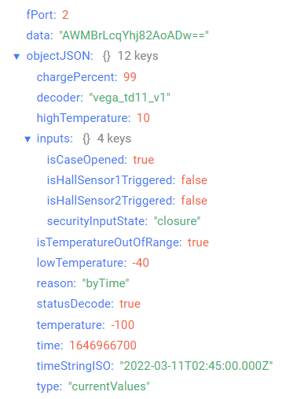
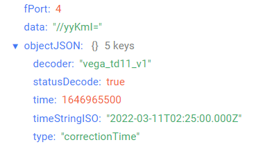
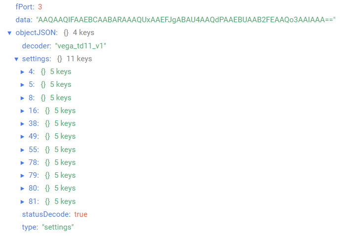

# Vega TD-11 - temperature sensor

## Device description

The Vega TD-11 temperature sensor is a LoRaWAN® transmitter with an external measuring element. The device can communicate with a specified period and transmit the temperature readings to the LoRaWAN® network. The external measuring element has a convenient mounting hole for fastening with a screw. The power element for the temperature sensor is a soldered battery with a capacity of 3600 mAh (SAFT), designed for a lifetime of up to 10 years in the transmission of data once a day.

## Description of data fields

### Current state packet

Current state packet sent on port 2 and contains the following fields:
- `chargePercent` - battery charge (%), data type `Number`;
- `decoder` - name and version of the decoder, data type `String`;
- `highTemperature` - temperature high threshold (°С), data type `Number`;
- `inputs` - inputs state, data type `Object`, contains the following fields:
    - `isCaseOpened` - case state (**true** - if case is opened и **false** - if case is not opened), data type `Boolean`;
    - `isHallSensor1Triggered` - Hall sensor 1 state (**true** - if sensor triggered, **false** - if sensor not triggered), data type `Boolean`;
    - `isHallSensor2Triggered` - Hall sensor 2 state (**true** - if sensor triggered, **false** - if sensor not triggered), data type `Boolean`;
    - `isSecurityInputClosed` - security input state (**true** - closed, **false** - unclosed), data type `String`;
- `isTemperatureOutOfRange` - temperature is out of range (**true** - if current temperature is out of range, **false** - if current temperature is not out of range), data type `Boolean`;
- `lowTemperature` - temperature low threshold (°С), data type `Number`;
- `reason` - sending reason (**byTime** - by the time, **bySecurityInputTriggered** - by alarm on the input 1, **byTamperSensorTriggered** - by the tamper sensor triggered, **byHallSensor1Triggered** - by the hall sensor 1 triggered, **byHallSensor2Triggered** - by the hall sensor 2 triggered, **byTemperatureOutOfRange** - by the temperature went out of range), data type `String`;
- `statusDecode` - data decode status (**true** if decode is successful and **false** if decode is not successful), data type `Boolean`;
- `temperature` - temperature (°С), data type `Number`;
- `time` - reading time for values in this packet in Unix-time format (sec), data type `Number`;
- `timeStringISO` - reading time for values in this packet in ISO format, data type `String`;
- `type` - packet type, data type `String`.

An example of decoded message:

### Time correction request packet

Time correction request packet sent on port 4 and contains the following fields:
- `decoder` - name and version of the decoder, data type `String`;
- `statusDecode` - data decode status (**true** if decode is successful and **false** if decode is not successful), data type `Boolean`;
- `time` - reading time for values in this packet in Unix-time format (sec), data type `Number`;
- `timeStringISO` - reading time for values in this packet in ISO format, data type `String`;
- `type` - packet type, data type `String`.

An example of decoded message:

### Setting packet

Setting packet sent on port 3 and contains the following fields:
- `decoder` - name and version of the decoder, data type `String`;
- `settings` - current device settings values, data type `Object` (object keys are setting identifiers);
- `statusDecode` - data decode status (**true** if decode is successful and **false** if decode is not successful), data type `Boolean`;
- `type` - packet type, data type `String`.

Setting object contains the following fields:
- `id` - unique identifier for the setting, data type `Number`;
- `length` - setting value length (байт), data type `Number`;
- `name` - setting name, data type `String`;
- `rawValue` - raw setting value, data type `String`;
- `value` - setting value, data type depends on parameter.

An example of decoded message:

