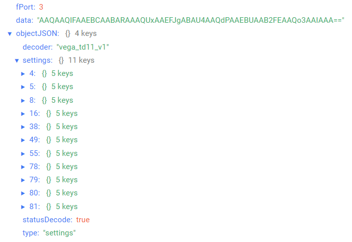

# Вега ТД-11 - температурный датчик

## Описание устройства

Датчик температуры Вега ТД-11 предназначен для снятия показаний с внешнего температурного датчика (входит в комплект поставки) с последующим накоплением и передачей этой информации в сеть LoRaWAN®. Устройство может выходить на связь как с заданным периодом, так и при выходе измеряемой температуры за установленные пределы. Внешний температурный датчик имеет удобное монтажное отверстие для крепления винтом.
Вега ТД-11 может быть использован как охранный датчик. Для этого устройство оснащено охранным входом и двумя датчиками Холла, которые реагируют на поднесение магнита. Кроме того, на плате установлен тампер для контроля вскрытия корпуса.

## Описание полей данных

### Пакет с текущим состоянием

Пакет с текущим состоянием приходит на порт 2 и содержит следующие поля:
- `chargePercent` - заряд батареи (%), тип данных `Number`;
- `decoder` - имя и версия дешифратора, тип данных `String`;
- `highTemperature` - верхний порог температуры (°С), тип данных `Number`;
- `inputs` - состояние входов/выходов, тип данных `Object`, содержит следующие поля:
    - `isCaseOpened` - признак вскрытия корпуса (**true** - если корпус открыт и **false** - если корпус закрыт), тип данных `Boolean`;
    - `isHallSensor1Triggered` - состояние датчика Холла 1 (**true** - зафиксировано наличие воздействия внешнего магнитного поля, **false** - не зафиксировано наличие воздействия внешнего магнитного поля), тип данных `Boolean`;
    - `isHallSensor2Triggered` - состояние датчика Холла 2 (**true** - зафиксировано наличие воздействия внешнего магнитного поля, **false** - не зафиксировано наличие воздействия внешнего магнитного поля), тип данных `Boolean`;
    - `isSecurityInputClosed` - состояние охранного входа (**true** - вход замкнут, **false** - вход разомкнут), тип данных `String`;
- `isTemperatureOutOfRange` - выход температуры за установленные пределы (**true** - если текущая температура не входит в допустимый диапазон, **false** - если текущая температура входит в допустимый диапазон), тип данных `Boolean`;
- `lowTemperature` - нижний порог температуры (°С), тип данных `Number`;
- `reason` - причина отправки пакета (**byTime** - по времени, **bySecurityInputTriggered** - по срабатыванию охранного входа, **byTamperSensorTriggered** - по срабатыванию датчика вскрытия, **byHallSensor1Triggered** - по срабатыванию датчика Холла 1, **byHallSensor2Triggered** - по срабатыванию датчика Холла 2, **byTemperatureOutOfRange** - по выходу температуры за допустимые пределы), тип данных `String`;
- `statusDecode` - состояние расшифровки данных (**true** если расшифровка успешна и **false** если неуспешна), тип данных `Boolean`;
- `temperature` - температура (°С), тип данных `Number`;
- `time` - время снятия показаний, передаваемых в пакете в формате Unix-time (с), тип данных `Number`;
- `timeStringISO` - время снятия показаний, передаваемых в пакете в формате ISO, тип данных `String`;
- `type` - тип пакета, тип данных `String`.

Пример расшифрованного сообщения:

### Пакет с запросом корректировки времени

Пакет с запросом корректировки времени приходит на порт 4 и содержит следующие поля:
- `decoder` - имя и версия дешифратора, тип данных `String`;
- `statusDecode` - состояние расшифровки данных (**true** если расшифровка успешна и **false** если неуспешна), тип данных `Boolean`;
- `time` - время снятия показаний, передаваемых в пакете в формате Unix-time (с), тип данных `Number`;
- `timeStringISO` - время снятия показаний, передаваемых в пакете в формате ISO, тип данных `String`;
- `type` - тип пакета, тип данных `String`.

Пример расшифрованного сообщения:

### Пакет с настройками

Пакет с настройками приходит на порт 3 и содержит следующие поля:
- `decoder` - имя и версия дешифратора, тип данных `String`;
- `settings` - текущие значения настроек устройства, тип данных `Object` (ключами объекта являются номера параметров);
- `statusDecode` - состояние расшифровки данных (**true** если расшифровка успешна и **false** если неуспешна), тип данных `Boolean`;
- `type` - тип пакета, тип данных `String`.

Объект параметра, содержит следующие поля:
- `id` - номера параметра, тип данных `Number`;
- `length` - длина значения параметра (байт), тип данных `Number`;
- `name` - имя параметра, тип данных `String`;
- `rawValue` - необработанное значение параметра, тип данных `String`;
- `value` - значение параметра, тип данных зависит от параметра.

Пример расшифрованного сообщения:

