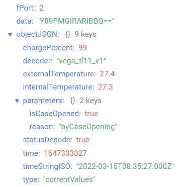
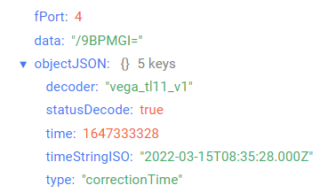
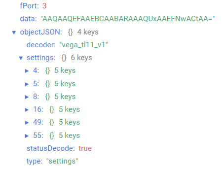

# Vega TL-11 - Temperature logger

## Device description

Thermologger designed for a long autonomic collection and storing of a data about controlled environment (air, non-aggressive gases, liquids, bulk materials, food). Temperature is measuring through two thermistors: external probe connecting to the thermologger and built-in external thermosensor. The device archives temperature measurements with the time check at the device memory and then transmits that archived data in the LoRaWAN® network when there is a stable radio connection.
Thermologger Vega TL-11 may be used in systems where it's needed to control the temperature through the long time without abillity to operative transmit data to the network, for example, when transporting perishable goods or when control of the conditions of transportation is needed. In transit the device puts product temperature values to the memory and when it's come to the destination the device will transmit saved data to the LoRaWAN network.

## Description of data fields

### Current state packet

Current state packet sent on port 2 and contains the following fields:
- `chargePercent` - battery charge (%), data type `Number`;
- `decoder` - name and version of the decoder, data type `String`;
- `externalTemperature` - temperature of external probe (°С), data type `Number`;
- `internalTemperature` - temperature of built-in thermistor (°С), data type `Number`;
- `parameters` - main parameters, data type `Object`, contains the following fields:
    - `isCaseOpened` - case state (**true** - if case is opened and **false** - if case is not opened), data type `Boolean`;
    - `reason` - sending reason (**byTime** - by the time, **byCaseOpening** - by the tamper sensor triggering), data type `String`;
- `statusDecode` - data decode status (**true** if decode is successful and **false** if decode is not successful), data type `Boolean`;
- `time` - reading time for values in this packet in Unix-time format (sec), data type `Number`;
- `timeStringISO` - reading time for values in this packet in ISO format, data type `String`;
- `type` - packet type, data type `String`.

An example of decoded message:

### Time correction request packet

Time correction request packet sent on port 4 and contains the following fields:
- `decoder` - name and version of the decoder, data type `String`;
- `statusDecode` - data decode status (**true** if decode is successful and **false** if decode is not successful), data type `Boolean`;
- `time` - reading time for values in this packet in Unix-time format (sec), data type `Number`;
- `timeStringISO` - reading time for values in this packet in ISO format, data type `String`;
- `type` - packet type, data type `String`.

An example of decoded message:

### Setting packet

Setting packet sent on port 3 and contains the following fields:
- `decoder` - name and version of the decoder, data type `String`;
- `settings` - current device settings values, data type `Object` (object keys are setting identifiers);
- `statusDecode` - data decode status (**true** if decode is successful and **false** if decode is not successful), data type `Boolean`;
- `type` - packet type, data type `String`.

Setting object contains the following fields:
- `id` - unique identifier for the setting, data type `Number`;
- `length` - setting value length (байт), data type `Number`;
- `name` - setting name, data type `String`;
- `rawValue` - raw setting value, data type `String`;
- `value` - setting value, data type depends on parameter.

An example of decoded message:

