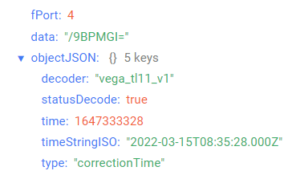
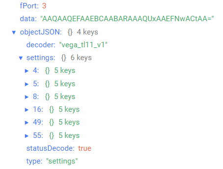

# Вега ТЛ-11 - Температурный логгер

## Описание устройства

Термологгер предназначен для длительного автономного сбора и хранения данных о контролируемой среде (воздух, неагрессивные газы, жидкости, сыпучие материалы, продукты питания). Температура измеряется с помощью двух терморезисторов: выносного щупа, подключенного к термологгеру, и встроенного наружного терморезистора. Значения температуры архивируются в памяти устройства с привязкой ко времени, а затем, при появлении устойчивой связи с LoRaWAN® сетью архивные данные выгружаются в сеть.
Продолжительную автономную работу обеспечивает батарея ёмкостью 6400 мАч.
Термологгер Вега ТЛ-11 может быть использован в системах, где требуется контроль температуры в течение долгого времени без возможности оперативно передать данные в сеть, например, при перевозке скоропортящихся грузов или когда нужен контроль условий перевозки. В пути устройство будет записывать в память значения температуры продукта, а по приезде в пункт назначения выгрузит сохраненные данные в сеть LoRaWAN®.

## Описание полей данных

### Пакет с текущим состоянием

Пакет с текущим состоянием приходит на порт 2 и содержит следующие поля:
- `chargePercent` - заряд батареи (%), тип данных `Number`;
- `decoder` - имя и версия дешифратора, тип данных `String`;
- `externalTemperature` - температура выносного щупа (°С), тип данных `Number`;
- `internalTemperature` - температура встроенного терморезистора (°С), тип данных `Number`;
- `parameters` - основные параметры, тип данных `Object`, содержит следующие поля:
    - `isCaseOpened` - признак вскрытия корпуса (**true** - если корпус открыт и **false** - если корпус закрыт), тип данных `Boolean`;
    - `reason` - причина отправки пакета (**byTime** - по времени, **byCaseOpening** - по срабатыванию датчика вскрытия), тип данных `String`;
- `statusDecode` - состояние расшифровки данных (**true** если расшифровка успешна и **false** если неуспешна), тип данных `Boolean`;
- `time` - время снятия показаний, передаваемых в пакете в формате Unix-time (с), тип данных `Number`;
- `timeStringISO` - время снятия показаний, передаваемых в пакете в формате ISO, тип данных `String`;
- `type` - тип пакета, тип данных `String`.

Пример расшифрованного сообщения:

### Пакет с запросом корректировки времени

Пакет с запросом корректировки времени приходит на порт 4 и содержит следующие поля:
- `decoder` - имя и версия дешифратора, тип данных `String`;
- `statusDecode` - состояние расшифровки данных (**true** если расшифровка успешна и **false** если неуспешна), тип данных `Boolean`;
- `time` - время снятия показаний, передаваемых в пакете в формате Unix-time (с), тип данных `Number`;
- `timeStringISO` - время снятия показаний, передаваемых в пакете в формате ISO, тип данных `String`;
- `type` - тип пакета, тип данных `String`.

Пример расшифрованного сообщения:

### Пакет с настройками

Пакет с настройками приходит на порт 3 и содержит следующие поля:
- `decoder` - имя и версия дешифратора, тип данных `String`;
- `settings` - текущие значения настроек устройства, тип данных `Object` (ключами объекта являются номера параметров);
- `statusDecode` - состояние расшифровки данных (**true** если расшифровка успешна и **false** если неуспешна), тип данных `Boolean`;
- `type` - тип пакета, тип данных `String`.

Объект параметра, содержит следующие поля:
- `id` - номера параметра, тип данных `Number`;
- `length` - длина значения параметра (байт), тип данных `Number`;
- `name` - имя параметра, тип данных `String`;
- `rawValue` - необработанное значение параметра, тип данных `String`;
- `value` - значение параметра, тип данных зависит от параметра.

Пример расшифрованного сообщения:

