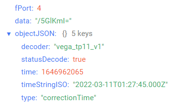

# Vega TP-11 - 4-20 mA converter

## Device description

The TP-11 converter is designed for reading data from devices with 4-20 mA interface with subsequent accumulation and transfer of this information to the LoRaWAN® network.The battery for the converter is an irreplaceable battery with 6400 mA capacity. With battery power, the converter operates as Class A LoRaWAN® device. The converter can operate from an external power source with a voltage of 10 ... 36 V. In that case, the converter operates as Class C device.In addition, the TP-11 converter has two security inputs that trigger the alarm message to the LoRaWAN® network and two open-drain outputs for the external devices control.

## Description of data fields

### Current state packet

Current state packet sent on port 2 and contains the following fields:
- `chargePercent` - battery charge (%), data type `Number`;
- `current` - measurement current of connected sensor (mA), data type `Number`;
- `decoder` - name and version of the decoder, data type `String`;
- `highLimit` - current high threshold (mA), data type `Number`;
- `inputsOutputs` - inputs/outputs state, data type `Object`, contains the following fields:
    - `output1State` - output 1 state (**closure** - closed, **unlocking** - unclosed), data type `String`;
    - `output2State` - output 2 state (**closure** - closed, **unlocking** - unclosed), data type `String`;
    - `powerState` - power state (**battery** - battery, **external** - external), data type `String`;
    - `securityInput1State` - security input 1 state (**closure** - closed, **unlocking** - unclosed), data type `String`;
    - `securityInput2State` - security input 2 state (**closure** - closed, **unlocking** - unclosed), data type `String`;
- `isLimitsExceeding` - current is out of range (**true** - if current is out of range, **false** - if current is not out of range), data type `Boolean`;
- `lowLimit` - current low threshold (mA), data type `Number`;
- `reason` - sending reason (**byTime** - by the time, **bySecurityInput1Triggered** - by alarm on the input 1, **bySecurityInput2Triggered** - by alarm on the input 2, **byExternalPowerStateChanged** - by the external power state changed, **byLimitsExceeding** - by the current out of range, **byRequest** - by the request), data type `String`;
- `statusDecode` - data decode status (**true** if decode is successful and **false** if decode is not successful), data type `Boolean`;
- `temperature` - temperature (°С), data type `Number`;
- `time` - reading time for values in this packet in Unix-time format (sec), data type `Number`;
- `timeStringISO` - reading time for values in this packet in ISO format, data type `String`;
- `type` - packet type, data type `String`.

An example of decoded message:

### Time correction request packet

Time correction request packet sent on port 4 and contains the following fields:
- `decoder` - name and version of the decoder, data type `String`;
- `statusDecode` - data decode status (**true** if decode is successful and **false** if decode is not successful), data type `Boolean`;
- `time` - reading time for values in this packet in Unix-time format (sec), data type `Number`;
- `timeStringISO` - reading time for values in this packet in ISO format, data type `String`;
- `type` - packet type, data type `String`.

An example of decoded message:

### Setting packet

Setting packet sent on port 3 and contains the following fields:
- `decoder` - name and version of the decoder, data type `String`;
- `settings` - current device settings values, data type `Object` (object keys are setting identifiers);
- `statusDecode` - data decode status (**true** if decode is successful and **false** if decode is not successful), data type `Boolean`;
- `type` - packet type, data type `String`.

Setting object contains the following fields:
- `id` - unique identifier for the setting, data type `Number`;
- `length` - setting value length (байт), data type `Number`;
- `name` - setting name, data type `String`;
- `rawValue` - raw setting value, data type `String`;
- `value` - setting value, data type depends on parameter.

An example of decoded message:

