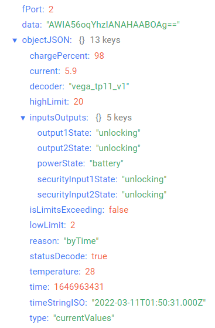
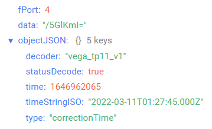
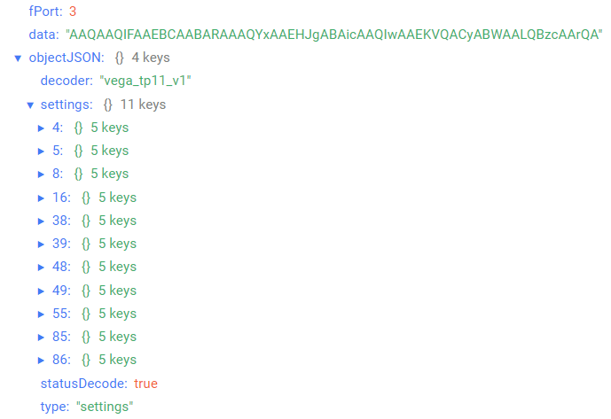

# Вега ТП-11 - конвертер 4-20мА

## Описание устройства

Конвертер Вега ТП-11 предназначен для считывания данных с устройств с интерфейсом 4-20 мА с последующим накоплением и передачей этой информации в сеть LoRaWAN®. Конвертер может работать от внешнего источника питания с напряжением 10…36 В, а также укомплектован батареей ёмкостью 6400 мАч для автономного питания. При питании от батареи конвертер работает как устройство LoRaWAN® класса A. При питании от внешнего источника конвертер работает как устройство класса С.
Вега ТП-11 может применяться в качестве охранного датчика. Любые из двух входов могут быть настроены в качестве охранных.
Кроме того, Вега ТП-11 оснащён двумя выходами типа «открытый коллектор», предназначенными для управления внешними устройствами.

## Описание полей данных

### Пакет с текущим состоянием

Пакет с текущим состоянием приходит на порт 2 и содержит следующие поля:
- `chargePercent` - заряд батареи (%), тип данных `Number`;
- `current` - измеренный ток устройства «токовая петля» (мА), тип данных `Number`;
- `decoder` - имя и версия дешифратора, тип данных `String`;
- `highLimit` - верхний лимит измеряемого параметра (мА), тип данных `Number`;
- `inputsOutputs` - состояние входов/выходов, тип данных `Object`, содержит следующие поля:
    - `output1State` - состояние выхода 1 (**closure** - замкнут, **unlocking** - разомкнут), тип данных `String`;
    - `output2State` - состояние выхода 2 (**closure** - замкнут, **unlocking** - разомкнут), тип данных `String`;
    - `powerState` - состояние питания устройства (**battery** - батарейное, **external** - внешнее), тип данных `String`;
    - `securityInput1State` - состояние охранного входа 1 (**closure** - замкнут, **unlocking** - разомкнут), тип данных `String`;
    - `securityInput2State` - состояние охранного входа 2 (**closure** - замкнут, **unlocking** - разомкнут), тип данных `String`;
- `isLimitsExceeding` - выход измеряемого параметра за установленные пределы (**true** - если измеряемый параметр не входит в допустимый диапазон, **false** - если измеряемый параметр входит в допустимый диапазон), тип данных `Boolean`;
- `lowLimit` - нижний лимит измеряемого параметра (мА), тип данных `Number`;
- `reason` - причина отправки пакета (**byTime** - по времени, **bySecurityInput1Triggered** - по срабатыванию охранного входа 1, **bySecurityInput2Triggered** - по срабатыванию охранного входа 2, **byExternalPowerStateChanged** - по изменению состояния внешнего питания, **byLimitsExceeding** - по выходу измеряемого параметра за установленные пределы, **byRequest** - по запросу), тип данных `String`;
- `statusDecode` - состояние расшифровки данных (**true** если расшифровка успешна и **false** если неуспешна), тип данных `Boolean`;
- `temperature` - температура (°С), тип данных `Number`;
- `time` - время снятия показаний, передаваемых в пакете в формате Unix-time (с), тип данных `Number`;
- `timeStringISO` - время снятия показаний, передаваемых в пакете в формате ISO, тип данных `String`;
- `type` - тип пакета, тип данных `String`.

Пример расшифрованного сообщения:

### Пакет с запросом корректировки времени

Пакет с запросом корректировки времени приходит на порт 4 и содержит следующие поля:
- `decoder` - имя и версия дешифратора, тип данных `String`;
- `statusDecode` - состояние расшифровки данных (**true** если расшифровка успешна и **false** если неуспешна), тип данных `Boolean`;
- `time` - время снятия показаний, передаваемых в пакете в формате Unix-time (с), тип данных `Number`;
- `timeStringISO` - время снятия показаний, передаваемых в пакете в формате ISO, тип данных `String`;
- `type` - тип пакета, тип данных `String`.

Пример расшифрованного сообщения:

### Пакет с настройками

Пакет с настройками приходит на порт 3 и содержит следующие поля:
- `decoder` - имя и версия дешифратора, тип данных `String`;
- `settings` - текущие значения настроек устройства, тип данных `Object` (ключами объекта являются номера параметров);
- `statusDecode` - состояние расшифровки данных (**true** если расшифровка успешна и **false** если неуспешна), тип данных `Boolean`;
- `type` - тип пакета, тип данных `String`.

Объект параметра, содержит следующие поля:
- `id` - номера параметра, тип данных `Number`;
- `length` - длина значения параметра (байт), тип данных `Number`;
- `name` - имя параметра, тип данных `String`;
- `rawValue` - необработанное значение параметра, тип данных `String`;
- `value` - значение параметра, тип данных зависит от параметра.

Пример расшифрованного сообщения:

