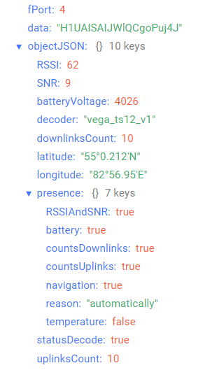

# Вега ТС-12 - тестер сети

## Описание устройства

Тестер сети Вега ТС-12 предназначен для осуществления этапа радиопланирования при развёртывании сетей стандарта LoRaWAN® . Тестер позволяет построить карту покрытия и принять решение о наилучшем размещении базовых станций и оконечных устройств относительно друг друга.
Благодаря встроенному аккумулятору устройство может автономно работать в течение нескольких часов. Аккумулятор подзаряжается через micro-USB стандартной зарядкой 5 В, до 1 А.
Принцип действия основан на следующем: ТС-12 отправляет в LoRaWAN® сеть специальный сигнал, в ответ на который сеть сообщает ему количество базовых станций, принявших данный сигнал и качество сигнала. Эти данные тестер отображает на дисплее всякий раз при нажатии кнопки.
Кроме того, тестер имеет функцию определения координат по спутникам. Когда эта функция включена, тестер непрерывно обновляет свои координаты и отправляет их вместе с остальными данными в стандартном пакете в сеть LoRaWAN®.
Используя информацию о координатах каждого замера, можно построить карту покрытия сети.

## Описание полей данных

Пакет от тестера сети приходит на порт 4 и содержит следующие поля:
- `batteryVoltage` - напряжение батареи (мВ), тип данных `Number`;
- `decoder` - имя и версия дешифратора, тип данных `String`;
- `downlinksCount` - счетчик принятых устройством пакетов, тип данных `Number`;
- `latitude` - широта, тип данных `String`;
- `longitude` - долгота, тип данных `String`;
- `presence` - присутствие данных, тип данных `Object`, содержит следующие поля:
    - `battery` - информация о состоянии батареи (**true** - если присутствует в пакете, **false** - если отсутствует в пакете), тип данных `Boolean`;
    - `countsDownlinks` - счетчик принятых пакетов (**true** - если присутствует в пакете, **false** - если отсутствует в пакете), тип данных `Boolean`;
    - `countsUplinks` - счетчик отправленных пакетов (**true** - если присутствует в пакете, **false** - если отсутствует в пакете), тип данных `Boolean`;
    - `navigation` - навигационные данные (**true** - если присутствуют в пакете, **false** - если отсутствуют в пакете), тип данных `Boolean`;
    - `reason` - причина отправки пакета (**automatically** - автоматически, **byButtonTriggering** - по нажатию на кнопку), тип данных `String`;
    - `RSSIAndSNR` - информация о RSSI и SNR (**true** - если присутствует в пакете, **false** - если отсутствует в пакете), тип данных `Boolean`;
    - `temperature` - информация о температуре (**true** - если присутствует в пакете, **false** - если отсутствует в пакете), тип данных `Boolean`;
- `RSSI` - абсолютное значение RSSI (дБ), тип данных `Number`;
- `SNR` - значение SNR с учетом знака (дБ), тип данных `Number`;
- `statusDecode` - состояние расшифровки данных (**true** если расшифровка успешна и **false** если неуспешна), тип данных `Boolean`;
- `temperature` - температура (°С), тип данных `Number`;
- `uplinksCount` - счетчик отправленных устройством пакетов, тип данных `Number`;

Пример расшифрованного сообщения:

